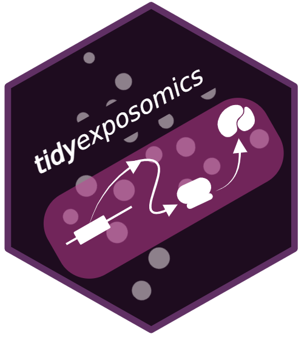
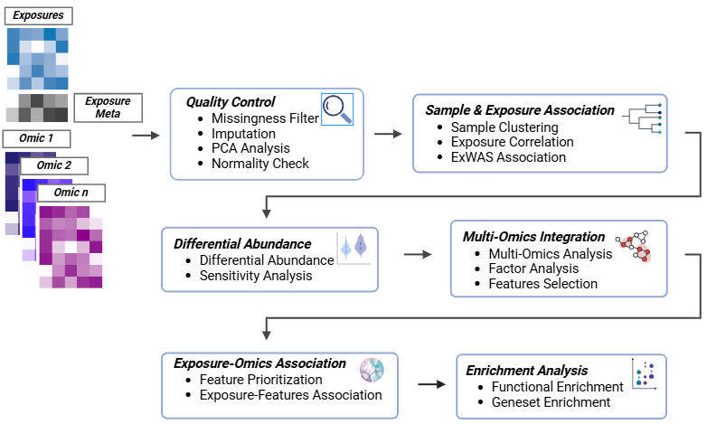

# tidyexposomics 

 
 
 
 

## Overview

The `tidyexposomics` package is designed to facilitate the integration of exposure and omics data to identify exposure-omics associations. We structure our commands to fit into the tidyverse framework, where commands are designed to be simplified and intuitive. Here we provide functionality to perform:

1. Quality Control
2. Sample and Exposure Association Analysis
3. Differential Abundance analysis
4. Multi-Omics Integration
5. Functional Enrichment Analysis

