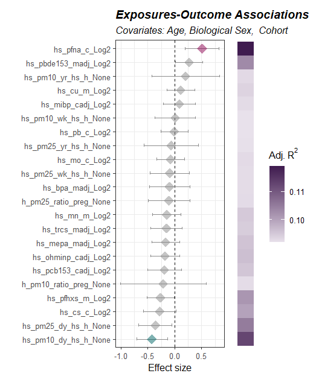
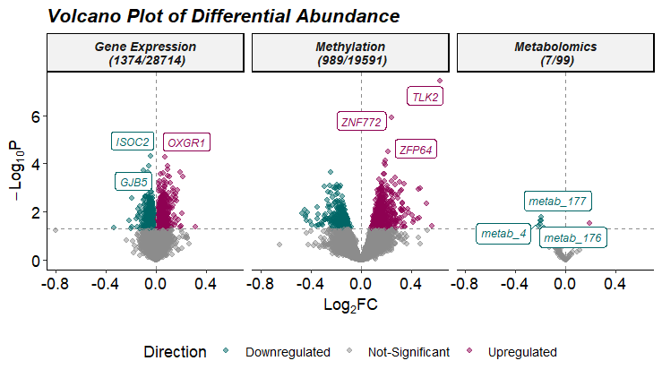
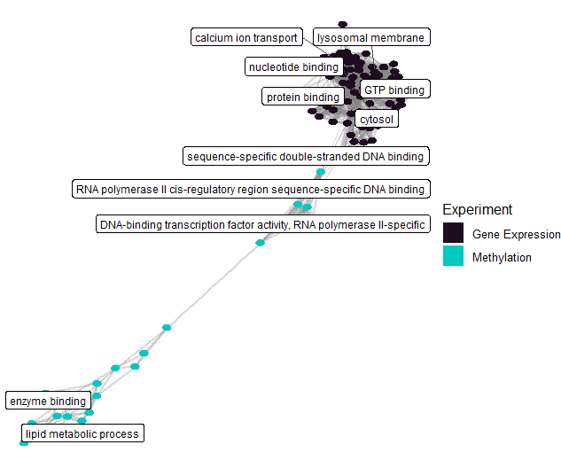

# tidyexposomics <a href="#"></a>

<br>
<br>
<br>
<br>

[`tidyexposomics` website](https://bionomad.github.io/tidyexposomics/index.html)

## Overview

The `tidyexposomics` package is designed to facilitate the integration of exposure and omics data to identify exposure-omics associations. We structure our commands to fit into the tidyverse framework, where commands are designed to be simplified and intuitive. Here we provide functionality to perform quality control, sample and exposure association analysis, differential abundance analysis, multi-omics integration, and functional enrichment analysis.

<p align="center" width="100%">
    
</p>

## Installation

You can install the development version of `tidyexposomics` from GitHub with:

```r
# Install directly through GitHub
remotes::install_github("BioNomad/tidyexposomics")
```

## Command Structure

To make the package more user-friendly, we have named our functions to be more intuitive. For example, we use the following naming conventions:

<p align="center" width="100%">
    
</p>

We provide functionality to either `add` results to the existing object storing the omics/exposure data or to return the direct results using the `get` option using the `action` argument. We suggest adding results, as we also include a `run_pipeline_summary()` function to generate a diagram or print out of the workflow. This is useful for keeping track of the pipeline steps. 


## Quick Start

The following code is a great way to get started with the package. It includes loading example data, performing basic quality control, running exposure-wide association studies (ExWAS), differential abundance analysis, correlating differentially expressed genes (DEGs) with exposures, and functional enrichment analysis.

### More to tidyexposomics!

However, there is so much more to the `tidyexposomics` package! So check out the [Get Started](articles/tidyexposomics.html) page for a more detailed walkthrough of the package's functionality.


## Installation

You can install `tidyexposomics` using the following code:

```R
# Install and Load Packages
remotes::install_github("BioNomad/tidyexposomics")
library(tidyexposomics)
library(tidyverse)
```

## Load Example Data

We provide example data based off the [ISGlobal Exposome data challenge 2021](https://www.sciencedirect.com/science/article/pii/S016041202200349X?via%3Dihub). Here, we will examine how exposures and omics features relate to asthma status.

```R
data(meta)           # Exposure & phenotype metadata
data(annotated_cb)   # Ontology-annotated codebook
data(omics_list)     # Omics data list
data(fdata)          # Omics row metadata

# Create ExpOmicSet
expom <- create_expomicset(
  codebook = annotated_cb,
  exposure = meta,
  omics = omics_list,
  row_data = fdata
)

# Grab exposure variables
exp_vars <- annotated_cb |> 
  filter(category %in% c(
    "exposure to oxygen molecular entity",
    "aerosol",
    "environmental zone",
    "main group molecular entity",
    "transition element molecular entity",
    "exposure to environmental process",
    "polyatomic entity" 
  )) |> 
  pull(variable) |> 
  as.character()
```

## Quality Control

We provide several quality control functions including those that handle filtering missing data, imputation, variable normality checks, and variable transformation.

```R
# Filter samples and exposures
expom <- expom[, !is.na(expom$hs_asthma)]
expom <- expom[, expom$FAS_cat_None == "Low"]

# Filter & impute exposures
expom <- expom |>
  filter_missing(na_thresh = 5) |>
  run_impute_missing(exposure_impute_method = "missforest")

# Filter omics
expom <- expom |> 
  filter_omics(
    method = "variance",
    assays = "Methylation",
    assay_name = 1,
    min_var = 0.05
  ) |> 
  filter_omics(
    method = "variance",
    assays = "Metabolomics",
    assay_name = 1,
    min_var = 0.1
  ) |>
  filter_omics(
    method = "expression",
    assays = "Gene Expression",
    assay_name = 1,
    min_value = 1,
    min_prop = 0.3
  )

# Check variable normality & transform variables
expom <- expom |> 
  # Check variable normality
  run_normality_check(action = "add") |> 
  
  # Transform variables 
  transform_exposure(transform_method = "boxcox_best",
                     exposure_cols = exp_vars) 
```

## ExWAS 

We may associate our exposures with a health outcome, and in this case, we associate our exposures with asthma status and adjust our model for child age, biological sex, and cohort.

```R
# Perform ExWAS Analysis
expom <- expom |> 
  run_association(
    source = "exposures",
    outcome = "hs_asthma",
    feature_set = exp_vars,
    covariates = c("hs_child_age_None",
                   "e3_sex_None",
                   "h_cohort"),
    action = "add",
    family = "binomial")

# Visualize associations
expom |> 
  plot_association(
    subtitle = paste("Covariates:",
                     "Age,",
                     "Biological Sex, ",
                     "Cohort"),
    source = "exposures",
    terms = exp_vars,
    filter_thresh = 0.15,
    filter_col = "p.value",
    r2_col = "adj_r2")
```



## Differential Abundance

Differentially abundant analysis is also supported in `tidyexposomics`. Here we use `limma_voom` to identify features associated with asthma status.

```R
# Run differential abundance analysis
expom_1 <- expom_1 |> 
  run_differential_abundance(
    formula = ~ hs_asthma + hs_child_age_None + e3_sex_None + h_cohort,
    method = "limma_voom",
    scaling_method = "none",
    action = "add")
    
# Plot Differential Abundance Results
expom_1 |> 
  plot_volcano(
    top_n_label = 3,
    feature_col = "feature_clean",
    logFC_thresh = log2(1),
    pval_thresh = 0.05,
    pval_col = "P.Value",
    logFC_col = "logFC",
    nrow = 1)
```



## Multi-Omics Integration

If several omics are present, we provide functionality to perform multiomics integration. Here we use the `DIABLO` method and set the outcome variable of interest to asthma status.

```R
# Perform Multi-Omics Integration
expom_1 <- expom_1 |> 
  run_multiomics_integration(method = "DIABLO",
                             n_factors = 5,
                             outcome = "hs_asthma",
                             action = "add")
                             
# Identify factors that correlate with the outcome
expom_1 <- expom_1 |> 
  run_association(
    source = "factors",
    outcome = "hs_asthma",
    feature_set = exp_vars,
    covariates = c(
      "hs_child_age_None",
      "e3_sex_None",
      "h_cohort"),
    action = "add",
    family = "binomial")
    
# Extract top features that contribute to a factor
expom_1 <- expom_1 |> 
  extract_top_factor_features(method = "percentile",
                              pval_col = "p_adjust",
                              pval_thresh = 0.05, 
                              percentile = 0.95,
                              action = "add") 
                              
# Determine which features drive multiple factors
expom_1 <- expom_1 |> 
  run_factor_overlap()
```


## Exposure-Omics Association

Now that we have our multiomics features associated with asthma status, we can correlate these with our exposures to identify how certain classes of exposures may be affecting asthma biology.

```R
# Grab top common factor features and ensure 
# feature is renamed to variable for the variable_map
top_factor_features <- expom_1 |> 
  extract_results(result = "multiomics_integration") |> 
  pluck("common_top_factor_features") |> 
  dplyr::select(variable=feature,
                      exp_name)

# Correlate top factor features with exposures
expom_1  <- expom_1 |> 
  # Perform correlation analysis between factor features 
  # and exposures
  run_correlation(feature_type = "omics",
                  variable_map = top_factor_features,
                  exposure_cols = exp_vars,
                  action = "add",
                  correlation_cutoff = 0.2,
                  pval_cutoff = 0.05,
                  cor_pval_column = "p.value") |> 
  # Perform correlation analysis between factor features
  run_correlation(feature_type = "omics",
                  variable_map = top_factor_features,
                  feature_cors = T,
                  action = "add",
                  correlation_cutoff = 0.2,
                  pval_cutoff = 0.05,
                  cor_pval_column = "p.value")
```


## Enrichment Analysis

After identifying features associated with asthma and exposures, we can perform functional enrichment analysis to understand what biological processes are affected.

```R
# Run enrichment analysis on factor features correlated with exposures
expom_1  <- expom_1  |> 
  run_enrichment(
    feature_type = c("omics_cor"),
    feature_col = "feature_clean",

    db = c("GO"), 
    species = "goa_human", 
    fenr_col = "gene_symbol",
    padj_method = "none",
    pval_thresh = .1,
    min_set = 1,
    max_set = 800,

    clustering_approach = "diana",
    action = "add"
  )

# Plot enrichment term network plot
expom_1    |> 
  plot_enrichment(
    feature_type = "omics_cor",
    plot_type = "network",
    label_top_n = 2
  )
```


