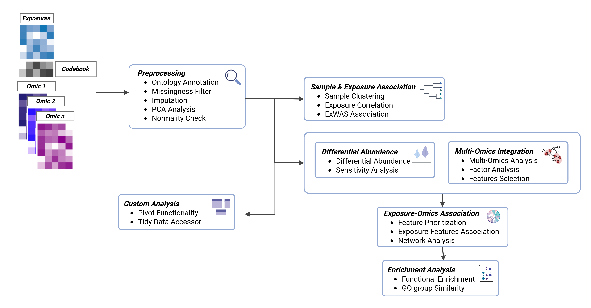
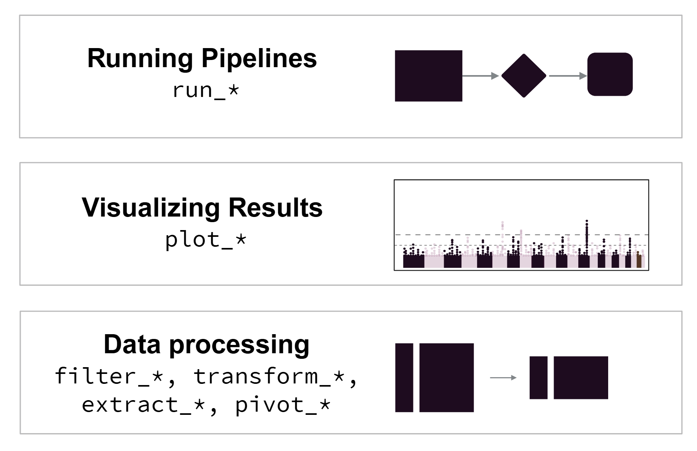

# tidyexposomics [](#)

  
  
  
  

- **Website:** <https://bionomad.github.io/tidyexposomics/index.html>

## Overview

The `tidyexposomics` package is designed to facilitate the integration
of exposure and omics data to identify exposure-omics associations.
Functions follow the tidyverse framework, where commands are designed to
be simplified and intuitive. The tidyexposomics package provides
functionality to perform quality control, sample and exposure
association analysis, differential abundance analysis, multi-omics
integration, and functional enrichment analysis.



## Command Structure

To make the package more user-friendly, we have named our functions to
be more intuitive. For example, we use the following naming conventions:



Results can be added to the `MultiAssayExperiment` object or returned
directly with `action = 'get'`. We suggest adding results, given that
pipeline steps are tracked and can be output to the R console, plotted
as a workflow diagram, or exported to an excel worksheet.

## Installation

The `tidyexposomics` package depends on R (\>= 4.5.0) and can be
installed using the following code:

``` r
# Install using Bioconductor
BiocManager::install("tidyexposomics")

# Install using devtools
devtools::install_github("bionomad/tidyexposomics")
```

## Getting Started

- [Getting
  Started](https://BioNomad.github.io/tidyexposomics/vignettes/tidyexposomics.Rmd)
