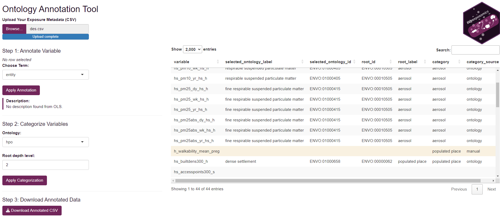

```{r setup,include=FALSE}
knitr::opts_chunk$set(echo = TRUE)
```

# Exposure Metadata and Ontology Annotation
<hr>

## Codebook Setup

Before starting an exposomics data analysis we recommend having a codebook, with information on your exposure variables. Some suggestions:

- **Variable Name**: The name of the variable in the data set.

- **Variable Description**: A concise description of what the variable measures, including units (e.g., “urinary bisphenol A (ng/mL)”).

- **Variable Type**: The type of variable, such as continuous, categorical, or binary.

- **Variable Period**: The period of time over which the variable was measured, such as “lifetime”, “year”, “month”, or “day”.

- **Variable Location**: The location where the variable was measured, such as “home”, “work”, “school”, or “geospatial code”.

- **Variable Ontology**: The ontology term associated with the variable.

## Ontology Choices

Variables captured in the codebook should be annotated with ontology terms to provide a standardized vocabulary for the variables. We recommend using the following ontologies for exposure and outcome variables:

- [Environment Exposure Ontology](https://www.ebi.ac.uk/ols4/ontologies/ecto) 
to annotate your exposure variables. 

- [Human Phenotype Ontology](https://www.ebi.ac.uk/ols4/ontologies/hp) to
annotate your outcome variables and phenotypic data.

- [Chemical Entities of Biological Interest](https://www.ebi.ac.uk/ols4/ontologies/chebi) 
to annotate your chemical exposure variables.

**Why annotate with ontologies?**

- **Interpretability**: Ontology labels clarify ambiguous or inconsistently named variables.

- **Harmonization**: You can compare and combine variables across datasets when they map to the same term.

- **Grouping**: Ontologies allow you to collapse fine-grained exposures into broader categories.

- **Integration**: Many public tools, knowledge graphs, and repositories are ontology-aware. This can make your results more interoperable and reusable.

## Ontology Annotation App

To help annotate exposure variables, we provide a lightweight shiny app:

```{r ontology-app,eval=FALSE}
# Launch the shiny app to annotate exposure variables
shiny::runApp(build_ont_annot_app())
```

**To use the app:**

- Click **Browse** to select your exposure metadata file.

- Then you can click the variable you’d like to link to an annotation term and search in the **Choose Ontology Term** dropdown.

- After you select a term, you will see a short description of the term.

- After you are done, click **Apply Annotate** to save the annotation.

- Now you can group exposures into larger categories by selecting each line and then choose your ontology and root depth level (where a lower number means a more general term).

- Then you can click **Apply Categorization** to apply the selected categorization to the selected rows.

- If the ontology has nothing to do with your variable, you may manually enter a category in the **Category** column. This will change the **Category Source** to manual and will not be linked to the ontology.

- Once you have annotated all your variables click **Download Annotated CSV** to save the annotated metadata file.


```{r ontology-app-img, echo=FALSE,out.width="150%",fig.align='center',fig.cap="Screenshot of the ontology annotation app. The sidebar has an upload button to load your exposure metadata file. The main panel displays the uploaded exposure metadata where users can select variables to annotate and categorize. The sidebar also contains buttons to apply annotations/categorizations and download the annotated file."}

```

## Session Info

<details>
  <summary>See Session Info</summary>
  
```{r session_info,collapse = TRUE}
sessionInfo()
```

</details>
