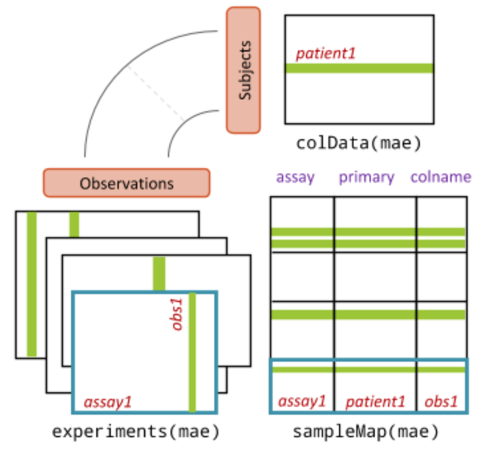

```{r, echo=FALSE}
htmltools::img(src = knitr::image_uri(file.path("../inst/logo.png")), 
               alt = 'logo', 
               style = 'position:absolute; top:0; right:0; padding:10px; height:2%')
```

```{r setup, include=FALSE}
knitr::opts_chunk$set(echo = TRUE)
```

```{r,echo=FALSE}
# Load data
load("../data/expom.RData")
load("../data/exp_vars.RData")
load("../data/all_vars.RData")
load("../data/expom_complete.RData")
invisible(lapply(
  list.files(path = "~/jhu/projects/tidyexposomics/R/",
             pattern="*.R",full.names = TRUE),
  source))
```


# Introduction

Exposure to environmental factors is a major determinant of health and disease. The exposome is a term that represents the totality of environmental exposures that drive disease and overall health [(Wild et al. 2005)](https://pubmed.ncbi.nlm.nih.gov/16103423/). To tackle the daunting task of characterizing the relationship between a multiplicity of exposures and disease outcomes, epidemiological studies have moved towards exposure wide association studies (ExWAS) where sets of exposures are associated with an outcome [(Chung et al. 2024)](https://academic.oup.com/exposome/article/4/1/osae001/7574628). The advent of high-throughput technologies has enabled profiling of several layers of biological information. These layers too can be integrated to better understand the relationship between exposures and disease outcomes.

The `tidyexposomics` package is designed to facilitate the integration of exposure and omics data to identify exposure-omics associations. We structure our commands to fit into the `tidyverse` framework, where commands are designed to be simplified and intuitive. Here we provide functionality to perform quality control, sample and exposure association analysis, differential abundance analysis, multi-omics integration, and functional enrichment analysis.

```{r echo = FALSE, message=FALSE, fig.align='center', fig.cap='tidyexposomics pipeline overview. Exposure and omics data are stored in a MultiAssayExperiment. Data then undergo quality cotnrol, sample and exposure associations, differential abundance analysis, multi-omics integration, and functional enrichment analysis. The pipeline is designed to be flexible and modular, allowing users to customize their analysis.',}
knitr::include_graphics("../inst/overview.png")
```

# Installation

```{r, eval=FALSE}
# install the current development version
devtools::install_github("BioNomad/tidyexposomics")
```


# Loading Data

To get started we need to load the data. The `expOmicSet` function is used to create a MultiAssayExperiment object that contains the exposure and omics data. As a quick introduction, a MultiAssayExperiment object is a container for storing multiple assays (e.g., omics data) and their associated metadata:


```{r xxx, echo = FALSE, message=FALSE,out.width='80%', fig.align='center', fig.cap='Overview of the MultiAssayExperiment Object Structure. Subject level data is captured within the `colData` of the MultiAssayExperiment. Observations are stored within `experiments` slots in the MultiAssayExperiment and `sampleMap` is used to link the data ( [MultiAssay Special Interest Group 2024](https://www.bioconductor.org/packages/release/bioc/vignettes/MultiAssayExperiment/inst/doc/MultiAssayExperiment.html) ).'}


```

We use the MultiAssayExperiment object to store the exposure and omics data. The `expOmicSet` function takes several arguments:

- The `var_info` argument is a data frame that contains information about the variables in the exposure meta data. 
- The `exposure` argument is a data frame that contains the exposure data, 
- The `omics` argument is a list of data frames that contain the omics data. 
- The `row_data` argument is a list of data frames that contain information about the rows of each omics data frame.


```{r,eval=FALSE}

# Create list of omics data frames
omics_list <- list(
  "CD16+ Monocyte RNA" = cd16_rna,
  "CD4+ T-cell RNA" = cd4_rna,
  "CD4+ T-cell miRNA"= cd4_mirna,
  "CD16+ Monocyte miRNA" = cd16_mirna,
  "Serum Proteomics" = prot_abd_unnorm,
  "Serum Adductomics" = adduct
)

# Create list of omics row data data frames
fdata <- list(
  "CD16+ Monocyte RNA" = cd16_rna_fdata,
  "CD4+ T-cell RNA" = cd4_rna_fdata,
  "CD4+ T-cell miRNA"= cd4_mirna_fdata,
  "CD16+ Monocyte miRNA" = cd16_mirna_fdata,
  "Serum Proteomics" = prot_fdata,
  "Serum Adductomics" = adduct_fdata
)

# Create the expOmicSet object
expom <- expOmicSet(
  var_info = des,
  exposure = aw_dataset_cv2_filt,
  omics = omics_list,
  row_data = fdata)
```

# Quality Control

## Missingness

Oftentimes when collecting data, there are missing values. The `filter_missing` function is used to filter out variables with too many missing values. The `na_thresh` argument is used to set the threshold for missing values. For example, if `na_thresh = 20`, then any variable with more than 20% missing values will be removed.

```{r,eval=FALSE}
expom_qc <- expom |> 
  # Filter out variables with too many missing values
  filter_missing(na_thresh = 20)
```

```{r,warning=FALSE,message=FALSE,fig.width=7,fig.height=4,out.width="80%",fig.align='center'}
# Check the number of missing values
expom_qc |> 
  plot_missing_summary(threshold = 20)
```

Here we see that the Serum adducts have the highest number of missing values, followed by the exposure data.

## Imputation

Now that we have filtered out the variables with too many missing values, we can impute the missing values. The `impute_missing` function is used to impute missing values.

```{r,eval=FALSE}
# Impute missing values
expom_qc <- expom_qc |> 
  impute_missing(
    exposure_impute_method = "median",
    omics_impute_method = "median")
```

## PCA Analysis

To identify the spread of the data, we can perform a principal component analysis (PCA). The `pca_analysis` function is used to perform PCA on samples with observations in each omics data frame. The `plot_pca` function is used to plot the PCA results. We automatically identify sample outliers based on the Mahalanobis distance, a measure of the distance between a point and a distribution. 


```{r,eval=FALSE}
# Perform PCA analysis
expom_qc <- expom_qc |> 
    pca_analysis() 
```


```{r,warning=FALSE,message=FALSE,fig.align='center',fig.width=10,fig.height=8}
# Plot Principal Component Analysis
expom_qc |> 
  plot_pca()
```

Here we see have two sample outliers, and that most variation is captured in the first two principal components for both features and samples.

## Normality Check

When determining variable associations it is important to check the normality of the data. The `check_normality` function is used to check the normality of the data. The `transform_exposure` function is used to transform the data to make it more normal. Here the `transform_method` is set to `best` as it will compare the normality of the data before and after transformation and select the best method. The `transform_method` can be set to `log2`, `sqrt`, or `x_1_3`. 


```{r,eval=FALSE}
# Check variable normality & transform variables
expom_qc <- expom_qc |> 
  # Check variable normality
  check_normality() |> 
  
  # Transform variables 
  transform_exposure(transform_method = "best") 
```

```{r,warning=FALSE,message=FALSE}
# expom_qc |> 
#   plot_normality_sum()
```

# Sample-Exposure Association

## Sample Clustering

The `cluster_samples` function is used to cluster samples based on the exposure data. The `clustering_approach` argument is used to set the clustering approach. The `clustering_approach` can be set to `diana`, `gap`, or `elbow`. 

```{r,eval=FALSE}
# Sample clustering
expom_sample_exp <- expom_qc |> 
  cluster_samples(exposure_cols = exp_vars,
                  clustering_approach = "diana")
```

```{r,message=FALSE,warning=FALSE,fig.height=5,fig.width=11,out.width="110%"}
# Plot sample clusters
expom_sample_exp |> 
  plot_sample_clusters(
    cols_of_interest = c(exp_vars,"age","pftfev1fvc_actual")) 
```

Here we see two clusters, largely driven by levels of Immunoglobulin E.

## Exposure Correlation

We can also correlate exposures with each other. The `plot_exposure_corr` function is used to plot the correlation between exposures. 

```{r}

```


## ExWAS Association

The `perform_exwas` function is used to perform ExWAS analysis. The `outcome` argument is used to set the outcome variable. The `exposures` argument is used to set the exposures of interest. The `covariates` argument is used to set the covariates to adjust for.

```{r,eval=FALSE}
# Perform ExWAS Analysis
expom_sample_exp <- expom_sample_exp |> 
  perform_exwas(
    outcome = "pftfev1fvc_actual",
    exposures = all_vars[
      !all_vars %in% c("pftfev1fvc_actual",
                       "age",
                       "sex",
                       "race")],
    covariates = c("age","sex","race")) 
```

```{r,warning=FALSE,message=FALSE,fig.height=5,fig.width=4,fig.align='center',out.width="60%"}
expom_sample_exp |> 
  plot_exp_outcome_association()
```

Here we see that PM10/PM2.5 exposure, and eosinophil levels are associated with FEV1/FVC after adjusting for age, sex, and race.

# Differential Abundance

## Differential Abundance

We also provide functionality to test for differentially abundant features associated with a particular outcome across several omics layers. Using a volcano plot, we can visualize the results of the differential abundance analysis.

```{r,eval=FALSE}
# Run differential abundance analysis
expom_da <- expom_sample_exp |> 
  run_differential_abundance(
    formula = ~ pftfev1fvc_actual + age + sex + race,
    method = "limma_voom",
    contrasts = c("pftfev1fvc_actual - (Intercept)"),
    minimum_counts = 1,
    minimum_proportion = 0.1,
    scaling_method = "none")
```

```{r,warning=FALSE,message=FALSE,fig.height=5,fig.width=11,fig.align='center'}
expom_da |> 
  plot_volcano()
```

We note that CD4+ T-cell RNA has the greatest number of differentially abundant features, followed by CD16+ monocyte RNA, serum proteomics, then CD16+ monocyte miRNA, CD4+ T-cell miRNA and serum adductomics.

## Sensitivity Analysis

Depending on pre-processing steps, the results of the differential abundance analysis may vary. The `sensitivity_analysis` function is used to perform a sensitivity analysis to determine the robustness of the results. Here we determine if a feature is still differentially abundant if different minimum values, proportions, scaling methods are used, and the inclusion of covariates.

```{r,eval=FALSE}
# Perform Sensitivity Analysis
expom_da <- expom_da |> 
  run_sensitivity_analysis(
    base_formula = ~ pftfev1fvc_actual + age + sex + race, 
    contrasts = c("pftfev1fvc_actual - (Intercept)"),
    methods = c("limma_voom"),
    scaling_methods = c("none"),
    min_counts_range = c(1,5),
    min_proportion_range = c(0.1,0.3),
    covariates_to_remove = c("age" , "sex" , "race")) 
```

```{r,warning=FALSE,message=FALSE,out.width='100%',fig.align='center'}
expom_da |> 
  plot_sensitivity_summary()

```

We note that transcriptomic assays have the greatest number of differentially abundant features and higher stability scores, here the sum of the number of times the feature was differentially abundant under different conditions

# Multi-Omics Integration

## Multi-Omics Integration

While differential abundance analysis per omic can deliver insights into how each omic is associated with a particular outcome, we may want to leverage methods which integrate multiple omics layers. The `multiomics_integration` function is used to integrate multiple omics layers. Here we use the `MCIA` method to integrate omics layers. 

```{r,eval=FALSE}
# Perform Multi-Omics Integration
expom_multi <- expom_da |> 
  multiomics_integration(method = "MCIA") 
```

## Factor Analysis

These methods are designed to identify factors that we can then associate with an outcome variable. Here we will use the `identify_relevant_factors` function to identify factors that are associated with FEV1/FVC. 

```{r,warning=FALSE,message=FALSE}
# Identify factors that correlate with the outcome
expom_multi <- expom_multi |> 
  identify_relevant_factors(outcome_var = "pftfev1fvc_actual", 
                            categorical = FALSE,
                            p_thresh = 0.1) 
```
We see that the third factor is associated with FEV1/FVC. Factors have loading scores which indicate the strength of the association between the factor and the features. Here we can extract the top features, those in the 95th percentile, associated with our factor of interest.  

```{r,warning=FALSE,message=FALSE}
expom_multi <- expom_multi |> 
  extract_top_factor_features(factors = "V3", 
                              method = "percentile",
                              percentile = 0.95,
                              threshold = 0.3)
```
# Exposure-Omics Association

## Exposure-Omics Association

Now we have the option to correlate either the top factor features, or differentially abundant features with exposures. Here we will correlate the top differentially abundant features with exposures. 

```{r,eval=FALSE}
# Correlate top differentially abundant features with exposures
expom_multi <- expom_multi |> 
  correlate_exposures_with_degs(exposure_cols = exp_vars) 
```

We can plot the results of the exposure-omics association analysis using the `plot_exp_feature_assoc_summary` function. 

```{r,message=FALSE,warning=FALSE,fig.height=6,fig.width=14,fig.align='center'}
expom_multi |> 
  plot_exp_feature_assoc_summary()
```

Here we note that transcriptomic features have a greater number of associations with exposures. Among exposures, we see that allergens have the greatest number of associations with features - although we note that there are more allergen variables than other exposure categories. So we include the number of features associated with each the top exposure, and the number of exposures associated with the top features.

# Enrichment Analysis

The benefit of grouping our exposures into categories is that we can perform enrichment analysis on the associated features to determine how broad categories of exposures are associated with features. The `run_functional_enrichment` function is used to perform enrichment analysis. Here we use the `deg_exp_cor` geneset to perform enrichment on differentially abundant features correlated with exposures. 

```{r,eval=FALSE}
# Perform Functional Enrichment Analysis
expom_enrich <- expom_multi |> 
  run_functional_enrichment(
    geneset = "deg_exp_cor",
    proteomics_assays = "Serum Proteomics",
    mirna_assays = c("CD16+ Monocyte miRNA","CD4+ T-cell miRNA"),
    pval_threshold = 0.05,
    logfc_threshold = log2(1.5))
```

We can plot our results using the `plot_exp_enrich_dotplot` function. 

```{r,fig.width=10,fig.height=10}
# Plot Functional Enrichment Results
expom_enrich |> 
    plot_exp_enrich_dotplot(geneset = "deg_exp_cor")
```
You'll notice that enrichment terms are organized into groups. These groups are based on the Jaccard similarity of genes. We then provide the top 5 groups of enrichment terms based on a score calculated as the mean of the negative Log~10~ of the p-value multiplied by the number of genes in the term. Here we that while allergens are broadly associated with all of the top enrichment term groups, chemicals and indoor pollutants are only consistently associated with RNA splicing.

## Refernces

1. https://pubmed.ncbi.nlm.nih.gov/16103423/
2. https://academic.oup.com/exposome/article/4/1/osae001/7574628
