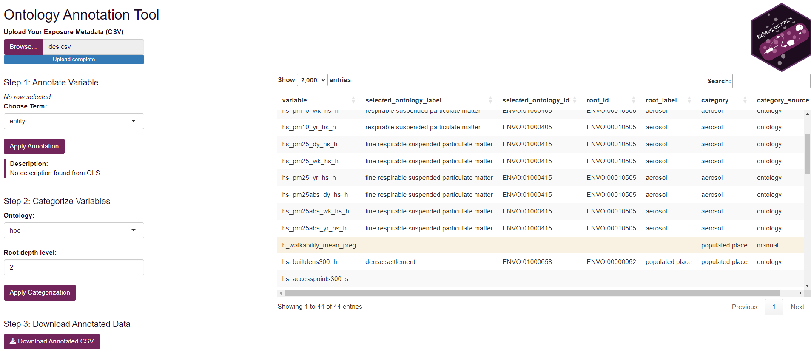
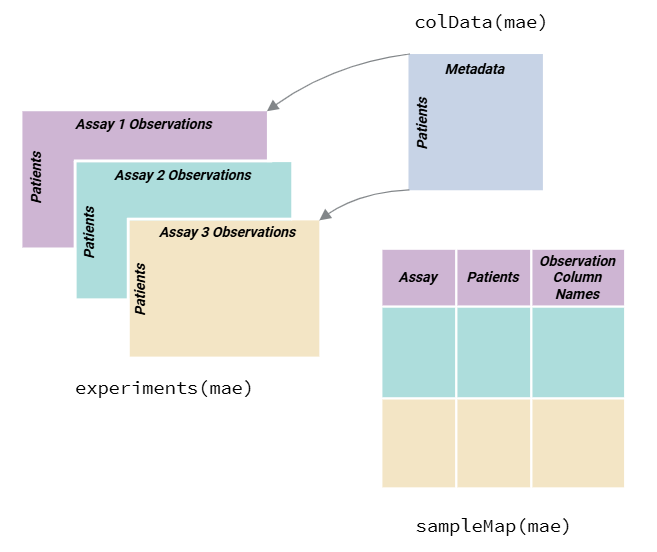

```{r setup, include=FALSE}
knitr::opts_chunk$set(echo = TRUE)
```


Exposure to environmental factors is a major determinant of health and disease.
The exposome is a term that represents the totality of environmental exposures
that drive disease and overall health
[(Wild et al. 2005)](https://pubmed.ncbi.nlm.nih.gov/16103423/). 
To tackle the daunting task
of characterizing the relationship between a multiplicity of exposures and
disease outcomes, epidemiological studies have moved towards exposure wide 
association studies (ExWAS) where sets of exposures are associated with an 
outcome 
[(Chung et al. 2024)](https://academic.oup.com/exposome/article/4/1/osae001/7574628). 
The advent of high-throughput technologies has enabled profiling of several
layers of biological information. These layers too can be integrated to better 
understand the relationship between exposures and disease outcomes.

The `tidyexposomics` package is designed to facilitate the integration of 
exposure and omics data to identify exposure-omics associations and their 
relevance to health outcomes. We structure our commands to fit into the 
`tidyverse` framework, where commands are designed to be simplified and 
intuitive. Here we provide functionality to perform quality control, sample 
and exposure association analysis, differential abundance analysis, 
multi-omics integration, and functional enrichment analysis.

```{r echo = FALSE, message=FALSE, out.width="120%",fig.align='center', fig.cap='**tidyexposomics pipeline overview.** Exposure and omics data are stored in a MultiAssayExperiment. Data then undergoes quality control, sample and exposure associations, differential abundance analysis, multi-omics integration, and functional enrichment analysis. The pipeline is designed to be flexible and modular, allowing users to customize their analysis.',}
knitr::include_graphics("./overview.png")
```

# Installation

```{r,eval=FALSE}
# install the current development version
remotes::install_github("BioNomad/tidyexposomics")

# load the package
library(tidyexposomics)
```

# Command Structure
<hr>

To make the package more user-friendly, we have named our functions to be more 
intuitive. For example, we use the following naming conventions:

```{r echo = FALSE, message=FALSE,fig.align='center'}
knitr::include_graphics("./command_str.png")
```


We provide functionality to either `add` results to the existing object storing 
the omics/exposure data or to return the direct results using the `get` option 
using the `action` argument. We suggest adding results, as we also include a 
`run_pipeline_summary()` function to generate a diagram of the workflow.
This is useful for keeping track of the pipeline steps. 

# Exposure Meta data and Ontology Annotation
<hr>

## Codebook Setup

Before starting an exposomics data analysis we recommend having a codebook,
with information on your exposure variables. Some suggestions:

- **Variable Name**: The name of the variable in the data set.

- **Variable Description**: A concise description of what the variable measures,
including units (e.g., "urinary bisphenol A (ng/mL)")

- **Variable Type**: The type of variable, such as continuous, categorical, 
or binary.

- **Variable Period**: The period of time over which the variable was measured, 
such as "lifetime", "year", "month", or "day".

- **Variable Location**: The location where the variable was measured, such as
"home", "work", or "school".

- **Variable Ontology**: The ontology term associated with the variable.

## Ontology Choices

Variables captured in the codebook should be annotated with ontology terms 
to provide a standardized vocabulary for the variables. We recommend using the 
following ontologies for exposure and outcome variables:

- [Environment Exposure Ontology](https://www.ebi.ac.uk/ols4/ontologies/ecto) 
to annotate your exposure variables. 

- [Human Phenotype Ontology](https://www.ebi.ac.uk/ols4/ontologies/hp) to
annotate your outcome variables and phenotypic data.

- [Chemical Entities of Biological Interest](https://www.ebi.ac.uk/ols4/ontologies/chebi) 
to annotate your chemical exposure variables.

**Now why should you bother doing this?**

- **Interpretability**: Ontology labels clarify ambiguous or inconsistently
named variables.

- **Harmonization**: You can compare and combine variables across datasets
when they map to the same term.

- **Grouping**: Ontologies allow you to collapse fine-grained exposures into 
broader categories.

- **Integration**: Many public tools, knowledge graphs, and repositories are 
ontology-aware. This can make your results more interoperable and reusable.

## Ontology Annotation App

To help annotate exposure variables, we provide a lightweight shiny app:

```{r,message=FALSE,warning=FALSE,eval=FALSE}
# Launch the shiny app to annotate exposure variables
ont_annot_app()
```

**To use the app:**

- Click **Browse** to select your exposure metadata file. 

- Then you can click the variable you'd like to link to an annotation term and 
search in the **Choose Ontology Term** dropdown. 

- After you select a term you will see a short description of the the term. 

- After your are done click **Apply Annotate** to save the annotation.

- Now you can group exposures into larger categories by selecting each line and 
then your ontology, and root depth level (where a lower number means a more 
general term).

- Then you can click **Apply Categorization** to apply the changes to the
selected rows.

- If the ontology has nothing to do with your variable, you may manually enter a
category in the **Category** column. This will change the **Category Source** to
`manual` and will not be linked to the ontology.

- Once you have annotated all your variables click **Download Annotated CSV**
to save the annotated metadata file.

```{r echo = FALSE, message=FALSE, out.width="150%",fig.align='center'}

```


# Loading Data
<hr>

To get started we need to load the data. The `create_expomicset` function is 
used to create a MultiAssayExperiment object that contains exposure and omics 
data. As a quick introduction, a MultiAssayExperiment object is a container 
for storing multiple assays (e.g., omics data) and their associated metadata:


```{r , echo = FALSE, message=FALSE, fig.align='center', fig.cap='**Overview of the MultiAssayExperiment Object Structure.** Subject level data is captured within the `colData` of the MultiAssayExperiment. Observations are stored within `experiments` slots in the MultiAssayExperiment and `sampleMap` is used to link the data ( [MultiAssay Special Interest Group 2024](https://www.bioconductor.org/packages/release/bioc/vignettes/MultiAssayExperiment/inst/doc/MultiAssayExperiment.html) ).'}


```

We use the MultiAssayExperiment object to store the exposure and omics data. 
The `create_expomicset` function has several arguments:

- The `codebook` argument is a data frame that contains information about the
variables in the exposure meta data. 
**The column names must contain `variable`** where the values are the 
column names of the exposure data frame, **and `category`** which contains 
general categories for the variable names. This is the data frame you created
with the ontology annotation app!

- The `exposure` argument is a data frame that contains the exposure and 
other metadata. 

- The `omics` argument is a list of data frames that contain the omics data. 

- The `row_data` argument is a list of data frames that contain information 
about the rows of each omics data frame.

We are going to start by loading in example data pulled from the 
[ISGlobal Exposome data challenge 2021](https://www.sciencedirect.com/science/article/pii/S016041202200349X?via%3Dihub). Specifically, we will examine how exposures and omics features relate to 
asthma status.

```{r,warning=FALSE,message=FALSE}
# Load Libraries
library(tidyverse)
library(tidyexposomics)

# Load the example data
load_example_data()

# Create the expomicset object
expom <- create_expomicset(
  codebook = annotated_cb,
  exposure = meta,
  omics = omics_list,
  row_data = fdata)
```


In this tutorial we will focus on asthma patients with a lower socioeconomic
status (SES):

```{r,warning=FALSE,message=FALSE}
# Keeping only samples with asthma status
expom <- expom[,!is.na(expom$hs_asthma)]
expom_1 <- expom[,expom$FAS_cat_None %in% c("Low")]
rm(expom)
```

We are interested in how exposure affects health outcomes, so let's define 
which meta data variables are our exposure variables of interest.

```{r,warning=FALSE,message=FALSE}
# Grab exposure variables
exp_vars <- annotated_cb |> 
  filter(category %in% c(
    "exposure to oxygen molecular entity",
    "aerosol",
    "environmental zone",
    "main group molecular entity",
    "transition element molecular entity",
    "exposure to environmental process",
    "polyatomic entity" 
  )) |> 
  pull(variable) |> 
  as.character()
```


# Quality Control
<hr>

## Missingness

Oftentimes when collecting data, there are missing values. Let's use the 
`plot_missing` function to determine where are missing values are:

```{r,warning=FALSE,message=FALSE,fig.height=4.5,fig.width=6}
expom_1 |> 
    plot_missing(plot_type = "summary",
                 threshold = 0)
```

Here we see that there are 10 variables in the exposure data that are 
missing data. Let's take a look at them:

```{r,warning=FALSE,message=FALSE,fig.height=4,fig.width=4}
expom_1 |> 
    plot_missing(plot_type = "lollipop",
                 threshold = 0,
                 layers = "Exposure")
```

Here we see that one variable, `hs_wgtgain_None`, has nearly 30% missing values!
We can apply a missingness filter using the `filter_missing` function. 
The `na_thresh` argument is used to set the threshold for missing values. 
For example, if `na_thresh = 20`, then any variable with more than 20% missing 
values will be removed. Here we set the threshold to 5% to filter out variables 
with more than 5% missing values.

```{r,warning=FALSE,message=FALSE}
# Filter out variables with too many missing values
expom_1 <- expom_1 |> 
  filter_missing(na_thresh = 5)
```

## Imputation

Now that we have filtered out the variables with too many missing values, 
we can impute the missing values. The `run_impute_missing` function is used 
to impute missing values. Here we can specify the imputation method for exposure
and omics data separately.

The `exposure_impute_method` argument is used to set the imputation method for 
exposure data, and the `omics_impute_method` argument is used to set the 
imputation method for omics data. The `omics_to_impute` argument is used to 
specify which omics data to impute. Here we will impute the exposure data 
given using the `missforest` method, but other options for imputation methods
include:

- `median`: Imputes missing values with the median of the variable.

- `mean`: Imputes missing values with the mean of the variable.

- `knn`: Uses k-nearest neighbors to impute missing values.

- `mice`: Uses the Multivariate Imputation by Chained Equations (MICE) method to
impute missing values.

- `dep`: Uses the DEP method to impute missing values.

- `missforest`: Uses the MissForest method to impute missing values.

- `lod_sqrt2`: Imputes missing values using the square root of the lower limit 
of detection (LOD) for each variable. This is useful for variables that have a 
lower limit of detection, such as chemical exposures.

```{r,warning=FALSE,message=FALSE}
# Impute missing values
expom_1 <- expom_1 |> 
  run_impute_missing(
    exposure_impute_method = "missforest")
```

## Filtering Omics Features

We can filter omics features based on variance or expression levels.
The `filter_omics` function is used to filter omics features. The `method`
argument is used to set the method for filtering. Here we can use either:

- **Variance**: Filters features based on variance. We recommend this for 
omics based on continuous measurements, such as log-transformed counts,
M-values, protein intensities, or metabolite concentrations.

- **Expression**: Filters features based on expression levels.
We recommend this for omics where many values may be near-zero or zero,
such as RNA-seq data.


The `assays` argument is used to specify which omics data to filter. 
The `assay_name` argument is used to specify which assay to filter.
The `min_var`, `min_value`, and `min_prop` arguments are used to set 
the minimum variance, minimum expression value, and minimum proportion 
of samples exceeding the minimum value, respectively.


```{r,warning=FALSE,message=FALSE}
# filter omics layers by variance and expression
expom_1 <- expom_1 |> 
  filter_omics(
    method = "variance",
    assays = "Methylation",
    assay_name = 1,
    min_var = 0.05
  ) |> 
  filter_omics(
    method = "variance",
    assays = "Metabolomics",
    assay_name = 1,
    min_var = 0.1
  ) |>
  filter_omics(
    method = "expression",
    assays = "Gene Expression",
    assay_name = 1,
    min_value = 1,
    min_prop = 0.3
  )
```

## Normality Check

When determining variable associations, it is important to check the normality
of the data. The `run_check_normality` function is used to check the normality 
of the data. 

The `transform_exposure` function is used to transform the data to make it 
more normal. Here the `transform_method` is set to `boxcox_best` as it will automatically select the best transformation method based on the data. The `transform_method` can be manually set to `log2`, `sqrt`, or `x_1_3` as well.
We specify the `exposure_cols` argument to set the columns to transform.


```{r,warning=FALSE,message=FALSE}
# Check variable normality & transform variables
expom_1 <- expom_1 |> 
  # Check variable normality
  run_normality_check(action = "add") |> 
  
  # Transform variables 
  transform_exposure(transform_method = "boxcox_best",
                     exposure_cols = exp_vars) 
```

To check the normality of the exposure data, we can use the 
`plot_normality_summary` function. This function plots the normality of
the data before and after transformation. The `transformed` argument is set 
to `TRUE` to plot the normality status of the transformed data.

```{r,warning=FALSE,message=FALSE,fig.width=4,fig.height=4}
expom_1 |>
  plot_normality_summary(
    transformed = TRUE
  )
```


## Principal Component Analysis

To identify the spread of the data, we can perform a principal
component analysis (PCA). The `run_pca` function is used to perform PCA 
on samples with observations in each omics data frame. Here we specify 
that we would like to log-transform the exposure and omics data before 
performing PCA using the `log_trans_exp` and the `log_trans_omics` arguments, 
respectively. We automatically identify sample outliers based on the 
Mahalanobis distance, a measure of the distance between a point and a 
distribution. 


```{r,warning=FALSE,message=FALSE}
# Perform principal component analysis
expom_1 <- expom_1 |> 
    run_pca(log_trans_exp = TRUE,
            log_trans_omics = TRUE,
            action = "add") 
```


```{r,warning=FALSE,message=FALSE,fig.align='center',fig.width=9,fig.height=7}
# Plot principal component analysis results
expom_1 |> 
  plot_pca()
```

Here we see have a few sample outliers, and that most variation is captured 
in the first two principal components for both features and samples. 
We can filter out these samples using the `filter_sample_outliers` function. 

```{r,warning=FALSE,message=FALSE}
# Filter out sample outliers
expom_1 <- expom_1 |> 
  filter_sample_outliers(
    outliers = c("s73", "s1183", "s376", "s899", "s828", "s993"))
```

To understand the relationship between the principal components and 
exposures we can correlate them using the `run_corrleation` function. 
Here we specify that the `feature_type` is `pcs` for principal components,
specify a set of exposure variables, `exp_vars`, and the number of principal 
components, `n_pcs`. We set `correlation_cutoff` to 0 and `pval_cutoff` to `
to initially include all correlations.


```{r,,warning=FALSE,message=FALSE}
expom_1 <- expom_1 |> 
  run_correlation(
  feature_type = "pcs",
  exposure_cols = exp_vars,
  n_pcs = 20,
  action = "add",
  correlation_cutoff = 0,
  pval_cutoff = 1
)
```


We can visualize these correlations with the `plot_correlation_tile` function.
We specify we are plotting the `feature_type` of `pcs` to grab the principal 
component correlation results. We then set the significance threshold to 0.05
with the `pval_cutoff` argument. 


```{r,warning=FALSE,message=FALSE,fig.width=7,fig.height=4}
expom_1 |> 
  plot_correlation_tile(
    feature_type = "pcs",
    pval_cutoff = 0.05
)
```

Here we note that particulate matter exposure and PFHXS exposure
(`hs_pfhxs_m_Log2`) are associated with the most principal components,
indicating these exposures are driving variation in the data.

## Exposure Summary

We can summarize the exposure data using the `run_summarize_exposures` function.
This function calculates summary statistics for each exposure variable,
including the number of values, number of missing values, minimum, maximum,
range, sum, median, mean, standard error, and confidence intervals. 
The `action` argument is set to `get` to return the summary statistics 
as a data frame. We specify the `exposure_cols` argument to set the columns to 
summarize. 


```{r, warning=FALSE,message=FALSE,fig.width=6,fig.height=4}
# Summarize exposure data
expom_1 |> 
  run_summarize_exposures(action = "get",
                          exposure_cols = exp_vars) |> 
  head()
```


## Exposure Visualization
<hr>

To visualize our exposure data, we can use the `plot_exposures` function. 
This function allows us to plot the exposure data in a variety of ways.
Here we will plot the exposure data using a boxplot. 
The `exposure_cat` argument is used to set the exposure category to plot. 
Additionally, we could specify, `exposure_cols` to only plot certain exposures.
The `plot_type` argument is used to set the type of plot to create.
Here we use a boxplot, but we could also use a ridge plot. 

```{r,fig.width=6.5,fig.height=3.5,message=FALSE,warning=FALSE}
# Plot exposure data
expom_1 |> 
  plot_exposures(
    group_by = "e3_sex_None",
    exposure_cat = "aerosol",
    plot_type = "boxplot",
    ylab = "Values",
    title = "Aerosol Exposure by Sex")
```

Here we see that there are not significant differences in aerosol exposure
between males and females.

# Sample-Exposure Association
<hr>

## Sample Clustering

The `run_cluster_samples` function is used to cluster samples based on the 
exposure data. The `clustering_approach` argument is used to set the clustering
approach to automatically identify clusters. Here we use the `dynamic` approach,
which uses a dynamic tree cut method to identify clusters. However,
you may choose between these other options as well:

- `gap`: **Gap statistic method (default)**; estimates optimal `k` by comparing 
within-cluster dispersion to that of reference data.

- `diana`: **Divisive hierarchical clustering (DIANA)**; chooses `k` based on 
the largest drop in dendrogram height.

- `elbow`: **Elbow method**; detects the point of maximum curvature in 
within-cluster sum of squares (WSS) to determine `k`.

- `dynamic`: **Dynamic tree cut**; adaptively detects clusters from a 
dendrogram structure without needing to predefine `k`.

- `density`: **Density-based clustering** (via `densityClust`); 
identifies clusters based on local density peaks in distance space.

```{r,warning=FALSE,message=FALSE}
# Sample clustering
expom_1 <- expom_1 |> 
  run_cluster_samples(
    exposure_cols = exp_vars,
    clustering_approach = "dynamic",
    action = "add") 
```

We plot the sample clusters using the `plot_sample_clusters` function. 
This function plots z-scored values of the exposure data for each sample, 
colored by the cluster assignment. The `exposure_cols` argument is used 
to set the columns to plot. 


```{r,message=FALSE,warning=FALSE,fig.height=8,fig.width=12,out.width="170%"}
# Plot sample clusters
expom_1 |> 
  plot_sample_clusters(
    exposure_cols = exp_vars)
```

Here we see five clusters, largely driven by particulate matter/aerosol 
exposure. Although it is worth noting that maternal PFHXS exposure 
(`hs_pfhxs_m_Log2`) appears to strongly drive Groups 3 and 4.

## Exposure Correlations

The `run_correlation` function can be used to correlate exposure variables.
The `feature_type` argument is used to set the type of features to correlate.
Here we use `exposures` to indicate that we are correlating exposure variables.
The `correlation_cutoff` argument is used to set the minimum correlation score
for the association. Here we use a cutoff of 0.3, but this can be adjusted 
based on the data.

```{r,,message=FALSE,warning=FALSE}
expom_1 <- expom_1 |> 
  run_correlation(feature_type = "exposures",
                  action = "add",
                  exposure_cols = exp_vars,
                  correlation_cutoff = 0.3)
```


To visualize the exposure correlations, we can use the `plot_circos_correlation`
or `plot_heatmap_correlate_exposure` functions. Here we will plot the 
circos plot. This function creates a circular plot of the exposure correlations.
The `correlation_cutoff` argument is used to set the minimum correlation score
for the association. Here we use a cutoff of 0.3.

```{r,warning=FALSE,message=FALSE,fig.height=10,fig.width=10,fig.align='center'}
expom_1 |> 
  plot_circos_correlation(feature_type = "exposures",
                          corr_threshold = 0.3,
                          exposure_cols = exp_vars)
```

Here we see that particulate matter exposure variables are highly correlated
and also correlated with maternalpregnancy BPA (`hs_bpa_madj_Log2`) and 
childhood PCB-153 (`hs_pcb153_cadj_Log2`) exposure.

## ExWAS Association

The `run_association` function is used to run the association analysis.
The `source` argument is used to set the source of the data to associate. 
The `outcome` argument is used to set the outcome variable. The `feature_set`
argument is used to set the features to include in the analysis. 
The `covariates` argument is used to set the covariates to include in the 
analysis. The `action` argument is set to `add` to add the results to the
existing object. The `family` argument is used to set the family of the model. 
Here we use `binomial` for a binary outcome.


```{r,warning=FALSE,message=FALSE}
# Perform ExWAS Analysis
expom_1 <- expom_1 |> 
  run_association(
    source = "exposures",
    outcome = "hs_asthma",
    feature_set = exp_vars,
    covariates = c("hs_child_age_None",
                   "e3_sex_None",
                   "h_cohort"),
    action = "add",
    family = "binomial")
```

To visualize the results of the ExWAS analysis, we can use the
`plot_association` function. This function plots the association results for
the specified features. The `terms` argument is used to set the features 
to plot. The `filter_thresh` argument is used to set the threshold for 
filtering the results. The `filter_col` argument is used to set the column 
to filter on. Here we use `p.value` to filter on the p-value of the
association. We can also include the adjusted R^2 using the `r2_col` argument.


```{r,warning=FALSE,message=FALSE,fig.height=6,fig.width=5,fig.align='center'}
expom_1 |> 
  plot_association(
    subtitle = paste("Covariates:",
                     "Age,",
                     "Biological Sex, ",
                     "Cohort"),
    source = "exposures",
    terms = exp_vars,
    filter_thresh = 0.15,
    filter_col = "p.value",
    r2_col = "adj_r2")
```

Here we see that particulate matter and PFNA (`hs_pfna_c_Log2`) are 
associated with asthma status after adjusting for age, biological sex, 
and cohort. Although the p-value threshold for this association is
quite generous.

We can also associate our omics features with an outcome of interest
using the `run_association()` function. Here we specify an additional argument,
`top_n`, which is used to set the top number of omics features to include 
per omic layer.

```{r,warning=FALSE,message=FALSE,fig.height=3,fig.width=4.5,fig.align='center'}
# Perform ExWAS Analysis
expom_1  <- expom_1 |> 
    run_association(
        outcome = "hs_asthma",
        source = "omics",
        covariates = c("hs_child_age_None",
                       "e3_sex_None",
                       "h_cohort"),
        top_n = 500,
        action = "add",
        family = "binomial")
```


We can visualize the results using a Manhattan plot. The `plot_manhattan` 
function is used to plot the results. The `pval_thresh` argument is used 
to set the p-value threshold for significance. The `vars_to_label` argument
is used to set the variables to label on the plot. The `min_per_cat` argument
is used to set the minimum number of significant features per category to
include in the plot. The `panel_sizes` argument is used to set the size of
each panel in the plot. 


```{r,warning=FALSE,message=FALSE,fig.height=7,fig.width=5,fig.align='center'}
expom_1 |> 
  plot_manhattan(
    min_per_cat = 0,
    feature_col = "feature_clean",
    vars_to_label = c("TC01000261.hg.1",
                      "TC15000063.hg.1",
                      "cg14780466",
                      "hs_pfna_c_Log2"),
    panel_sizes = c(1,3,1,1,3,1,1),
    facet_angle = 0)
```

## Exposome Scores
<hr>

We can also calculate exposome scores, which are a summary measure of 
exposure. The `run_exposome_score` function is used to calculate the 
exposome score. The `exposure_cols` argument is used to set the columns 
to use for the exposome score. The `score_type` argument is used to set 
the type of score to calculate. Here we could use:

- `median`: Calculates the median of the exposure variables.

- `mean`: Calculates the mean of the exposure variables.

- `sum`: Calculates the sum of the exposure variables.

- `pca`: Calculates the first principal component of the exposure variables.

- `irt`: Uses Item Response Theory to calculate the exposome score.

- `quantile`: Calculates the quantile of the exposure variables.

The `score_column_name` argument is used to set the name of the column 
to store the exposome score in. Here we will define a score for 
PFAS using a variety of different methods and demonstrate their use 
in association with asthma status.

```{r,warning=FALSE,message=FALSE,results = 'hide'}
# determine which PFAS to use
pfas <- c("hs_pfhxs_m_Log2","hs_pfna_c_Log2")

expom_1 <- expom_1 |> 
  run_exposome_score(exposure_cols = pfas,
                     score_type = "median",
                     score_column_name = "exposome_median_score") |> 
  run_exposome_score(exposure_cols = pfas,
                     score_type = "pca",
                     score_column_name = "exposome_pca_score") |> 
  run_exposome_score(exposure_cols = pfas,
                     score_type = "irt",
                     score_column_name = "exposome_irt_score") |> 
  run_exposome_score(exposure_cols = pfas,
                     score_type = "quantile",
                     score_column_name = "exposome_quantile_score") |> 
  run_exposome_score(exposure_cols = pfas,
                     score_type = "var",
                     score_column_name = "exposome_var_score")
```


We can then associate these exposome scores with the outcome of 
interest using the `run_association` function, just like we did before.
However, this time we specify our `feature_set` to be the exposome scores
we just calculated. 

```{r,warning=FALSE,message=FALSE}
# Associate Exposome Scores with Outcome
expom_1 <- expom_1 |> 
  run_association(
    outcome = "hs_asthma",
    source = "exposures",
    feature_set = c("exposome_median_score",
                    "exposome_pca_score",
                    "exposome_irt_score",
                    "exposome_quantile_score",
                    "exposome_var_score"),
    covariates = c("hs_child_age_None",
                   "e3_sex_None",
                   "h_cohort"),
    action = "add",
    family = "binomial")
```


To plot the results of the exposome score association with the outcome,
we can use the `plot_association` function:

```{r,warning=FALSE,message=FALSE,fig.height=3,fig.width=5,fig.align='center'}
expom_1 |> 
  plot_association(
    subtitle = c("Covariates: Age, Biological Sex, Cohort"),
    source = "exposures",
    terms = c("exposome_median_score",
                        "exposome_pca_score",
                        "exposome_irt_score",
                        "exposome_quantile_score",
                        "exposome_var_score"),
    filter_col = "p.value",
    filter_thresh = 0.05)
```

Here we see that most scores are associated with a increased probability 
of asthma. The item response theory (IRT) score is the only one that is 
significant.

# Differential Abundance
<hr>

## Differential Abundance

We also provide functionality to assess differentially abundant features
associated with a particular outcome across several omics' layers. The 
`run_differential_abundance` function is used to run the 
differential abundance analysis. The `formula` argument is used to set the
formula for the model. 
The `method` argument is used to set the method to use for the differential 
abundance analysis. Here we use the `limma_voom` method, which is a popular
method for differential abundance analysis. The `minimum_counts` and 
`minimum_proportion` arguments are used to filter out features with low counts 
or low proportions. The `scaling_method` argument is used to set the 
scaling method to use. Here we use `none`, but we could also use `quantile`
or `TMM`. The `action` argument is set to `add` to add the results to the 
existing object.

```{r,warning=FALSE,message=FALSE,results = 'hide'}
# Run differential abundance analysis
expom_1 <- expom_1 |> 
  run_differential_abundance(
    formula = ~ hs_asthma + hs_child_age_None + e3_sex_None + h_cohort,
    method = "limma_voom",
    scaling_method = "none",
    action = "add") 
```


Using a volcano plot, we can visualize the results of the differential
abundance analysis. The `plot_volcano` function is used to plot the results.
The `pval_col` argument is used to set the column containing the p-values.
The `pval_thresh` argument is used to set the p-value threshold for
significance. The `logFC_thresh` argument is used to set the log fold change
threshold for significance. The `top_n_label` argument is used to set the number 
of top features to label on the plot. The `nrow` argument is used to set the
number of rows in the facet layout. We can use the `feature_col` to specify 
which feature name column to plot. Here we set it to `feature_clean` as this 
column contains the gene/metabolite name information per feature.

**Note:** we set the `pval_col` to `P.Value` for the purposes of this example,
but we recommend keeping the default of `adj.P.Val` 
to use the adjusted p-values.


```{r,warning=FALSE,message=FALSE,fig.height=4,fig.width=7,fig.align='center'}
# Plot Differential Abundance Results
expom_1 |> 
  plot_volcano(
    top_n_label = 3,
    feature_col = "feature_clean",
    logFC_thresh = log2(1),
    pval_thresh = 0.05,
    pval_col = "P.Value",
    logFC_col = "logFC",
    nrow = 1)
```


## Sensitivity Analysis

Depending on pre-processing steps, the results of the differential abundance 
analysis may vary. The `sensitivity_analysis` function is used to perform a
sensitivity analysis to determine the robustness of the results. 
Here we determine if a feature is still differentially abundant if 
different minimum values, proportions, scaling methods are used, 
the inclusion of covariates, and after bootstrapping. We then define
a stability score based on the number of times a feature is found to 
be differentially abundant under different conditions as well as the 
consistency of the effect size:

$$ Stability\ Score = \frac{\sum_i{(p_i < \alpha)}}{N} * \frac{1}{1 + \frac{\sigma_{\beta}}{\mu_{|\beta|}}}$$

Where: 

- $p_i$ is the p-value for the $i^{th}$ test

- $\alpha$ is the significance threshold

- $N$ is the number of tests

- $\sigma_{\beta}$ is the standard deviation of the effect size estimates

- $\mu_{|\beta|}$ is the mean of the absolute value of the effect size 
estimates. 

The first term captures the proportion of tests that are significant, 
while the second term captures the consistency of the effect size estimates. 
The stability score ranges from 0 to 1.

A stability score of 1 indicates that the feature is always found to be 
differentially abundant, while a stability score of 0 indicates that the
feature is never found to be differentially abundant. Besides these, 
we provide other score metrics as well:

- `presence_rate`: Proportion of runs in which the feature’s p-value 
is below the specified threshold (selection frequency).

- `effect_consistency`: Inverse of the coefficient of variation of 
log fold-changes; measures effect size stability across runs.

- `stability_score`: Hybrid score combining `presence_rate` and
`effect_consistency`, capturing reproducibility and signal strength.

- `mean_log_p`: Average of negative log-transformed p-values; 
represents overall statistical signal strength.

- `logp_weighted_score`: Product of `mean_log_p` and `effect_consistency`;
highlights consistently strong features.

- `sd_logFC`: Standard deviation of log fold-change estimates;
quantifies variability of effect sizes.

- `iqr_logFC`: Interquartile range of log fold-changes; provides a 
robust measure of effect size spread.

- `cv_logFC`: Coefficient of variation of log fold-changes; 
reflects relative variability of effect size.

- `sign_flip_freq`: Proportion of runs where the sign of the
effect size differs from the overall average direction.

- `sd_log_p`: Standard deviation of log-transformed p-values; 
indicates variability in statistical signal.


```{r,,message=FALSE,warning=FALSE,results = 'hide'}
# Perform Sensitivity Analysis
expom_1 <- expom_1 |> 
  run_sensitivity_analysis(
    base_formula = ~ hs_asthma + hs_child_age_None + h_cohort, 
    methods = c("limma_voom"),
    scaling_methods = c("none"),
    covariates_to_remove = c(
      "hs_child_age_None",
      "e3_sex_None",
      "h_cohort"),
    pval_col = "P.Value",
    logfc_col = "logFC",
    logFC_threshold = log2(1),
    pval_threshold = 0.05,
    stability_metric = "stability_score",
    bootstrap_n = 10,
    action = "add") 
```


Here we plot the sensitivity analysis results using the
`plot_sensitivity_summary` function. The `stability_score_thresh`
argument is used to set the stability score threshold for significance.
Here we use a threshold of 0.1, but this can again be adjusted as needed.


```{r,warning=FALSE,message=FALSE,fig.align='center',fig.width=8,fig.height=3}
# Plot sensitivity analysis results
expom_1 |> 
  plot_sensitivity_summary(stability_score_thresh = 0.1,
                           stability_metric = "stability_score")
```


# Multi-Omics Integration
<hr>

## Multi-Omics Integration

While differential abundance analysis per omic can deliver insights
into how each omic is associated with a particular outcome, we may want 
to leverage methods which integrate multiple omics layers. The 
`run_multiomics_integration` function is used to integrate multiple omics 
layers. Here we use either `MCIA`, `RGCCA`, `MOFA`, or the `DIABLO` method 
to integrate omics layers:

- `MCIA`: Multiple Co-inertia Analysis, a method that uses canonical 
correlation analysis to integrate multiple omics layers. We use the 
nipalsMCIA algorithm to compute the co-inertia scores from the [nipalsMCIA package](https://www.bioconductor.org/packages/release/bioc/html/nipalsMCIA.html).

- `RGCCA` : Generalized canonical correlation for flexible multi-block 
integration implemented using the [RGCCA package](https://rgcca-factory.github.io/RGCCA/).

- `MOFA`: Multi-Omics Factor Analysis, a method that uses factor analysis 
to integrate multiple omics layers. MOFA is implemented using the [MOFA2 package](https://www.bioconductor.org/packages/release/bioc/html/MOFA2.html).

- `DIABLO`: DIABLO: Supervised multi-block PLS for outcome-aligned latent 
factors implemented using the [mixOmics package](https://www.bioconductor.org/packages/devel/bioc/html/mixOmics.html).


Here we are interested in integrating our omics layers with the end goal of
identifying multiomics features that are associated with asthma status. 
So we will use the `DIABLO` method.

```{r,warning=FALSE,message=FALSE}
# Perform Multi-Omics Integration
expom_1 <- expom_1 |> 
  run_multiomics_integration(method = "DIABLO",
                             n_factors = 5,
                             outcome = "hs_asthma",
                             action = "add") 
```

We can then use `plot_factor_summary()` to visualize which omics contribute
most to which factors. 

```{r,warning=FALSE,message=FALSE,fig.height=2,fig.width=5,fig.align='center'}
# Plot multi-omics factor summary
expom_1 |> 
  plot_factor_summary(midpoint = 4)
```

Here we see that these factors are largely driven by features in the 
methylation and gene expression assays.

## Factor Analysis

These methods are designed to identify factors that we can then associate
with an outcome variable. Here we will use the `run_association` function to
identify factors that are associated with asthma status after controlling for
child age, sex, and cohort. 

```{r,warning=FALSE,message=FALSE}
# Identify factors that correlate with the outcome
expom_1 <- expom_1 |> 
  run_association(
    source = "factors",
    outcome = "hs_asthma",
    feature_set = exp_vars,
    covariates = c(
      "hs_child_age_None",
      "e3_sex_None",
      "h_cohort"),
    action = "add",
    family = "binomial")


```


Now let's see if any of our factors are associated with asthma status after 
adjusting for child age, sex, and cohort:

```{r,warning=FALSE,message=FALSE,fig.width=5,fig.height=5}
expom_1 |> 
  plot_association(
    source = "factors",
    subtitle = c("Covariates: Age, Sex, Cohort"),
    filter_col = "p_adjust",
    filter_thresh = 0.05,
    r2_col = "adj_r2")
```

We see that several factors are associated with our outcome. Factors have 
loading scores which indicate the strength of the association between the 
factor and the features. Here we can extract the top features, those in the
90th percentile, per omic, associated with our factors of interest. 
We set the `pval_col` and `pva_thresh` to filter our association results to
grab the factors that pass our thresholds. However, we could specify 
specific factors with the `factors` argument too.

```{r,warning=FALSE,message=FALSE}
# Extract top features that contribute to a factor
expom_1 <- expom_1 |> 
  extract_top_factor_features(method = "percentile",
                              pval_col = "p_adjust",
                              pval_thresh = 0.05, 
                              percentile = 0.95,
                              action = "add") 
```

We can visualize the top features associated with each factor using the 
`plot_top_factor_features` function. The `top_n` argument is used to set 
the number of top features to plot. The `factors` argument is used to set 
the factors to plot.

```{r,warning=FALSE,message=FALSE,fig.height=8,fig.width=6,fig.align='center'}
# Plot top factor features
expom_1 |> 
  plot_top_factor_features(
    top_n = 15,
    factors = c("Methylation comp3",
                "Gene Expression comp3",
                "Methylation comp1"),
    feature_col = "feature_clean")
```

To identify the common features across factors, we can use the 
`run_factor_overlap` function. This function will identify the features 
that are shared across the top factor features. 

```{r,warning=FALSE,message=FALSE}
# Determine which features drive multiple factors
expom_1 <- expom_1 |> 
  run_factor_overlap()
```


Here we see that there are 703  features that are shared across the factors. 

# Exposure-Omics Association
<hr>

## Exposure-Omics Association

Now we have the option to correlate either the top factor features, 
differentially abundant features, or user specified omics features 
(by using a variable map, a data frame with two columns, `exp_name` 
for the name of the omics assay, and `variable` for the name of the 
molecular feature) with exposures.

Here we will correlate features driving multiple latent factors with exposures.
To grab these features we will grab them from the metadata in our 
MultiAssayExperiment object. The `correlation_cutoff` is used to set the
minimum correlation score, while the `pval_cutoff` is used to set the maximum
p-value for the association. 


```{r,warning=FALSE,message=FALSE}
# Grab top common factor features and ensure 
# feature is renamed to variable for the variable_map
top_factor_features <- expom_1 |> 
  extract_results(result = "multiomics_integration") |> 
  pluck("common_top_factor_features") |> 
  dplyr::select(variable=feature,
                      exp_name)

# Correlate top factor features with exposures
expom_1  <- expom_1 |> 
  # Perform correlation analysis between factor features 
  # and exposures
  run_correlation(feature_type = "omics",
                  variable_map = top_factor_features,
                  exposure_cols = exp_vars,
                  action = "add",
                  correlation_cutoff = 0.2,
                  pval_cutoff = 0.05,
                  cor_pval_column = "p.value") |> 
  # Perform correlation analysis between factor features
  run_correlation(feature_type = "omics",
                  variable_map = top_factor_features,
                  feature_cors = TRUE,
                  action = "add",
                  correlation_cutoff = 0.2,
                  pval_cutoff = 0.05,
                  cor_pval_column = "p.value")
```


We can plot the results of the exposure-omics association analysis using the 
`plot_bar_correlate_summary` function. Here we set the mode to `summary`, which
will plot the number of associations per exposure and feature type. The 
`feature_type` argument is used to set the type of features to plot. 
Here we use `omics`, which are the top factor features. 


```{r,message=FALSE,warning=FALSE,fig.height=9,fig.width=13,fig.align='center'}
expom_1  |> 
  plot_correlation_summary(mode = "summary",
                           feature_type = "omics")
```

Here we note that gene expression features have a greater number of
associations with exposures. Among exposures, we see that aerosols 
have the greatest number of associations with features. Although this 
is probably due to there being more aerosol exposures than other exposure types.

It may also be useful to identify which exposures are correlated with 
similar molecular features. We can do this with the `plot_circos_correlation`
function. This function will plot a circos plot of the exposures and their 
shared features. The `feature_type` argument is used to set the correlation 
results to use for the analysis. Here we use the `omics` feature set,
which plots the  feature - exposure correlation information. The cutoff
argument is used to set the minimum number of shared features to plot. 
Here we set the `shared_cutoff` to 1, which means that only exposures 
that share at least one feature will be plotted.


```{r,fig.width=10,fig.height=9,message=FALSE,warning=FALSE}
# Plot Shared Feature Correlations Between Exposures
expom_1  |> 
  plot_circos_correlation(feature_type = "omics",
                          shared_cutoff = 1,
                          midpoint = 3)
```

Here we see that particulate matter exposures are correlated with many of the
same features. However, we also see that maternal methyl paraben exposure
(`hs_mepa_madj_Log2`) is correlated with many of the same features, suggesting 
that this exposure may have similar effects on the molecular features.

## Network Analysis

The `run_create_network` function is used to create a network of exposures 
and omics features. The correlation results are used to create the network. 
The `feature_type` argument is used to set the type of features to use for
the network. Here we use `omics`, the top factor features we isolated. 
However we could choose any of the following:

- `degs`: Differentially abundant features correlated with exposures.

- `factors`: Factor features correlated with exposures.

- `omics`: User specified omics features correlated with exposures.


```{r,fig.width=10,fig.height=7,message=FALSE,warning=FALSE}
expom_1   <- expom_1 |> 
  run_create_network(
    feature_type = "omics_feature_cor",
    action = "add") |> 
  run_create_network(
    feature_type = "omics",
    action = "add")
```


To plot the network we can use the `plot_network` function. The `network`
argument is used to set the type of network to plot. The `top_n_nodes` 
argument is used to set the number of nodes to plot. The `node_color_var`
argument is used to set the variable to color the nodes by. The `label`
argument is used to set whether or not to label the nodes. We can label
the top n nodes, where the default is 5 nodes based on centrality. 
Additionally, we can chose to label certain nodes using the 
`nodes_to_label` argument. The `facet_var` argument is used to 
set the variable to facet the plot by. The `foreground` argument is 
used to set the color of the facets. We can also include the network 
statistics using the `include_stats` argument. 


```{r,fig.width=10,fig.height=5,message=FALSE,warning=FALSE}

expom_1    |>
    plot_network(
        network = "omics",
        top_n_nodes = 100,
        include_stats = TRUE,
        cor_thresh =0.2, 
        node_color_var = "group",
        label = TRUE,
        label_top_n = 5)

```


Here we note that the network is highly connected, with particulate 
matter and methyl paraben exposures having the most connections to
omics features. To briefly explain the metrics mentioned:

- **Nodes**: Number of nodes included in the graph.

- **Edges**: Number of connections between nodes in the graph.

- **Components**: Number of disconnected subgraphs.

- **Diameter**: The longest shortest path between any two nodes.

- **Mean Distance**: The average shortest path between any two nodes.

- **Modularity**: A measure of the division in the graph, where higher
modularity indicates that nodes within the same community are more densely
connected compared to nodes in different communities.


## Exposure-Omics Impact Network Analysis

When we examine the relationships between exposures and omics features, 
we can see that some features are more central to the network than others.
This is because some features are more highly correlated with exposures 
than others. The `run_exposure_impact` function is used to run an 
exposure-omics impact analysis. This function calculates 
centrality metrics for each exposure in the network. 
Centrality metrics are used to identify features that are more
central to the network and may be more important in the context 
of the exposure-omics relationships. The centrality metrics included are:

- **Mean Betweenness Centrality**: Measures how often a node lies on the
shortest path between other nodes where high values indicate potential 
intermediates.

- **Mean Closeness Centrality**: Measures how close a node is to all 
others in the network where high values indicate faster access to all nodes.

- **Mean Degree**: The average number of direct connections or edges a node has.

- **Mean Eigenvector Centrality**: Measure how well-connected a node is and how
well-connected its neighbors are, where high values suggest influence in a 
well-connected cluster.


```{r,,message=FALSE,warning=FALSE}
# Run exposure-omics impact analaysis
expom_1 <- expom_1 |> 
  run_exposure_impact(feature_type = "omics")
```


To plot the results of the exposure-omics impact analysis, we can use the 
`plot_exposure_impact` function. We set `feature_type` to `omics`, 
which means that we are plotting the network metrics of the omics features
correlated with exposures. The `min_per_group` argument is used to set the 
minimum number of features per group to plot. This is useful for filtering
out exposures that do not have enough associated features. 

```{r,fig.width=6,fig.height=7,message=FALSE,warning=FALSE,fig.align='center'}
# Plot exposure-omics impact results
expom_1 |> 
  plot_exposure_impact(
    feature_type = "omics",
    min_per_group = 10)
```

Here we see that maternal triclosan (`hs_trcs_madj_Log2`) exposure is 
associated with omics features that are central to our network, despite 
not having the most number of features associated with it. This suggests 
that maternal triclosan exposure may have a significant impact on the omics 
features, even if it is not associated with as many features as some of the
other exposures.


# Enrichment Analysis
<hr>

The benefit of grouping our exposures into categories is that we can 
perform enrichment analysis on the associated features to determine how 
broad categories of exposures are associated with features. The `run_enrichment`
function is used to perform enrichment analysis. Here we could enrich the 
following feature types:

- `degs`: Differentially abundant features.

- `degs_robust`: Robust differentially abundant features from the
sensitivity analysis.

- `omics`: User chosen features.

- `factor_features`: Multi-omics factor features either from 
`factor_type` = "common_top_factor_features" or "top_factor_features".

- `degs_cor`: Differentially abundant features correlated with a set 
of exposures.

- `omics_cor`: User chosen features correlated with a set of exposures.

- `factor_features_cor`:  Multi-omics factor features correlated with 
a set of exposures.

Here we will run enrichment analysis on our chosen factor features 
correlated with exposures. We specify `feature_col` to represent the 
column in our feature metadata with IDs that can be mapped (i.e. gene names).
We will be performing Gene ontology enrichment powered by the [`fenr` package](https://www.bioconductor.org/packages/release/bioc/html/fenr.html). 
You'll notice that we specify a `clustering_approach`. This will cluster our 
enrichment terms by the molecular feature overlap.

```{r,warning=FALSE,message=FALSE}
# Run enrichment analysis on factor features correlated with exposures
expom_1  <- expom_1  |> 
  run_enrichment(
    feature_type = c("omics_cor"),
    feature_col = "feature_clean",

    db = c("GO"), 
    species = "goa_human", 
    fenr_col = "gene_symbol",
    padj_method = "none",
    pval_thresh = .1,
    min_set = 1,
    max_set = 800,

    clustering_approach = "diana",
    action = "add"
  )
```


## Enrichment Visualizations

To visualize our enrichment results we provide several options:

- `dotplot`: A dot plot showing the top enriched terms. The size of the dots 
represents the number of features associated with the term, while the color
represents the significance of the term.

- `cnet`: A network plot showing the relationship between features and 
enriched terms.

- `network`: A network plot showing the relationship between enriched terms.

- `heatmap`: A heatmap showing the relationship between features and 
enriched terms.
            
- `summary`: A summary figure of the enrichment results.

### Enrichment Summary

To summarize the enrichment results, we can use the `plot_enrichment` 
function with the `plot_type` argument set to `summary`. This will plot
a summary of the enrichment results, showing:

- The number of exposure categories per enrichment term group.

- The number of features driving the enrichment term group.

- A p-value distribution of the enrichment term group.

- The number of terms in the enrichment term group.

- The total number of terms per experiment name.

- The overlap in enrichment terms between experiments (i.e. between gene 
expression and methylation).

```{r,warning=FALSE,message=FALSE, fig.width=13,fig.height=6}
expom_1    |> 
  plot_enrichment(
    feature_type = "omics_cor",
    plot_type = "summary"
  )
```

Here we see that it is just the features associated with "polyatomic entity" 
exposures that seem to be enriched. Additionally, there appears to be no
overlap in terms between methylation and gene expression results. 

### DotPlot

By setting the `plot_type` to `dotplot` we can create a dotplot to show which
omics and which exposure categories are associated with which terms. By 
specifying the `top_n_genes` we can add the most frequent features in that 
particular enrichment term group.

```{r,warning=FALSE,message=FALSE,fig.height=11,fig.width=11}
expom_1    |> 
  plot_enrichment(
    feature_type = "omics_cor",
    plot_type = "dotplot",
    top_n = 15,
    add_top_genes = TRUE,
    top_n_genes = 5
  )
```

Here we see that group 3 is driven by features in both gene expression and
methylation.

### Term Network Plot

We can set the `plot_type` to `network` to understand how our enrichment 
terms are individually connected. 

```{r,warning=FALSE,message=FALSE,fig.width=6,fig.height=5}
expom_1    |> 
  plot_enrichment(
    feature_type = "omics_cor",
    plot_type = "network",
    label_top_n = 2
  )
```

At the individual term level we see that they differ by omic layer, with the
gene expression driving terms related to protein binding and the methylation 
data driving terms related to lipid metabolism.

### Heatmap

Setting the `plot_type` to `heatmap` can help us understand which genes are 
driving the enrichment terms. We have the additional benefit of being able 
to color our tiles by the Log_2_Fold Change from our differential abundance 
testing. Here we will examine group 5, given it seems be driven by the most 
terms and multiple omics layers.

```{r,warning=FALSE,message=FALSE,fig.height=3,fig.width=8}
expom_1    |> 
  plot_enrichment(
    feature_type = "omics_cor",
    go_groups = "Group_5",
    plot_type = "heatmap",
    heatmap_fill = TRUE,
    feature_col = "feature_clean"
  )
```

Here we see that methylation features have the strongest fold change with
respect to asthma status. Interestingly, we see that methylation of *CYP2E1*,
an enzyme responsible for toxicant metabolism, is downregulated in 
asthma and correlated with with exposures in the `polyatomic entity` category 
containing chemicals like triclosan, BPA and several PFAS.

### Cnet Plot

Another way to visualize this information is with the cnet plot, where the 
enrichment terms are connected to the genes driving them.

```{r,warning=FALSE,message=FALSE,fig.width=6,fig.height=6}
expom_1    |> 
  plot_enrichment(
    feature_type = "omics_cor",
    go_groups = "Group_5",
    plot_type = "cnet",
    feature_col = "feature_clean"
  )
```


# Custom Analysis

Now what if there are analyses, summary statistics, or plots that you would 
like to create on your own? We provide functionality to access the underlying
data in the `MultiAssayExperiment` object and construct tibbles for your own 
analysis: 

- `pivot_sample`: Pivot the sample data to a tibble with samples as rows and
exposures as columns.

- `pivot_feature`: Pivot the feature meta data to a tibble with features as 
rows and feature meta data as columns.

- `pivot_exp`: Pivot the sample and experiment assay data to a tibble with 
samples as rows and sample meta data as columns. Additionally, there will 
be a column for values for specified features in specified assays.

## Pivot Sample

Let's check out the `pivot_sample` function. This function pivots the sample
data to a tibble with samples as rows and exposures as columns.

```{r,warning=FALSE,message=FALSE,fig.height=3,fig.width=6,fig.align='center'}
# Pivot sample data to a tibble
expom_1  |> 
  pivot_sample() |> 
  head()
```
We could use this functionality to count the number of asthmatics per sex:

```{r,warning=FALSE,message=FALSE,fig.height=3,fig.width=6,fig.align='center'}
expom_1  |> 
  pivot_sample() |> 
  group_by(hs_asthma,hs_smk_parents_None) |> 
  summarise(n = n()) 
```

## Pivot Feature

The `pivot_feature` function pivots the feature meta data to a tibble with 
features as rows and feature meta data as columns. This can be useful for
exploring the feature metadata in a more flexible way.

```{r,warning=FALSE,message=FALSE,fig.height=3,fig.width=6,fig.align='center'}
# Pivot feature data to a tibble
expom_1  |> 
  pivot_feature() |> 
  head()
```

We could use this functionality to count the number of features per omic 
layer, or to filter features based on their metadata. For example, we can 
count the number of features per omic layer:

```{r,warning=FALSE,message=FALSE,fig.height=3,fig.width=6,fig.align='center'}
# Count the number of features per omic layer
expom_1  |> 
    pivot_feature() |> 
    group_by(.exp_name) |> 
    summarise(n = n())
```


## Pivot Experiment

Now if we want to grab assay data from a particular experiment, we can do 
that with the `pivot_exp`. Let's try grabbing assay values for the `cg25330361` 
probe (methylation probe for CYP2E1) in the `Methylation` experiment:

```{r,warning=FALSE,message=FALSE,fig.height=3,fig.width=6,fig.align='center'}
# Pivot experiment data to a tibble
expom_1  |> 
  pivot_exp(omics_name = "Methylation",
            features = "cg25330361") |> 
  head()
```

We can use this functionality to create custom plots or analyses based on 
the exposure and feature data. For example, we can plot the methylation levels
of CYP2E1 by asthma status:

```{r,warning=FALSE,message=FALSE,fig.height=4,fig.width=4,fig.align='center'}
# Plot the distribution of a specific feature across samples
expom_1  |> 
  pivot_exp(omics_name = "Methylation",
            features = "cg25330361") |> 
  ggplot(aes(x = as.character(hs_asthma), 
             y = log2(counts+1),
             color = as.character(hs_asthma),
             fill = as.character(hs_asthma))) +
  geom_boxplot(alpha=0.5) +
  geom_jitter(alpha=0.1) +
  ggpubr::geom_pwc(
     label = "{p.adj.format}{p.adj.signif}"
  )+
  theme_minimal()+
  ggpubr::rotate_x_text(angle = 45)+
  ggsci::scale_color_cosmic()+
  ggsci::scale_fill_cosmic()+
  labs(x = "",
       y = expression(Log[2]*"Abd."),
       fill = "Asthma Status",
       color = "Asthma Status")
```

# Pipeline Summary

To summarize the steps we have taken in this analysis, we can use the 
`run_pipeline_summary` function. This function will provide a summary of the 
steps taken in the analysis. We can set `console_print` to `TRUE` to print the
summary to the console. Setting `include_notes` to `TRUE` will include notes on
the steps taken in the analysis.


```{r,fig.width=5,fig.height=15,message=FALSE,warning=FALSE}
# Run the pipeline summary
expom_1  |> 
  run_pipeline_summary(
    console_print = TRUE,
    include_notes = TRUE)
```


## Saving Results

We can export the results in our MultiAssayExperiment to an excel spreadsheet 
using the `extract_results_excel` function. Here we add all of our results to
the excel file, but we can choose certain results by changing the
`result_types` argument.

```{r,warning=FALSE,message=FALSE,eval=FALSE}
extract_results_excel(expom_1, 
                      file = "./supplementary_results.xlsx",
                      result_types = "all")
```


## Session Info

```{r,warning=FALSE,message=FALSE}
sessionInfo()
```

## References

1. Wild CP. Complementing the genome with an ‘exposome’: the
outstanding challenge of environmental exposure measurement in 
molecular epidemiology. *Cancer Epidemiol Biomarkers Prev.* 2005;
14(8):1847–1850. [PubMed](https://pubmed.ncbi.nlm.nih.gov/16103423/)

2. Chung MK, Holmes L, Gao X, Ghosh D, Li Y, Lee YJ. Decoding the exposome:
data science methodologies and implications in exposome-wide association studies
(ExWASs). *Exposome.* 2024;4(1):osae001. 
[Exposome](https://academic.oup.com/exposome/article/4/1/osae001/7574628)

3. Maitre L, Guimbaud JB, Warembourg C, Güil-Oumrait N, Petrone PM, 
Chadeau-Hyam M, Vrijheid M, Basagaña X, Gonzalez JR; Exposome Data 
Challenge Participant Consortium. State-of-the-art methods for 
exposure-health studies:
Results from the exposome data challenge event. *Environ Int.* 2022;168:107422. 
doi: 
[10.1016/j.envint.2022.107422](https://doi.org/10.1016/j.envint.2022.107422)

4. MultiAssay Special Interest Group. MultiAssayExperiment: Manage and Analyze
Multi-Omics Experiments. *Bioconductor Vignette*, 2024. [Link](https://www.bioconductor.org/packages/release/bioc/vignettes/MultiAssayExperiment/inst/doc/MultiAssayExperiment.html)
