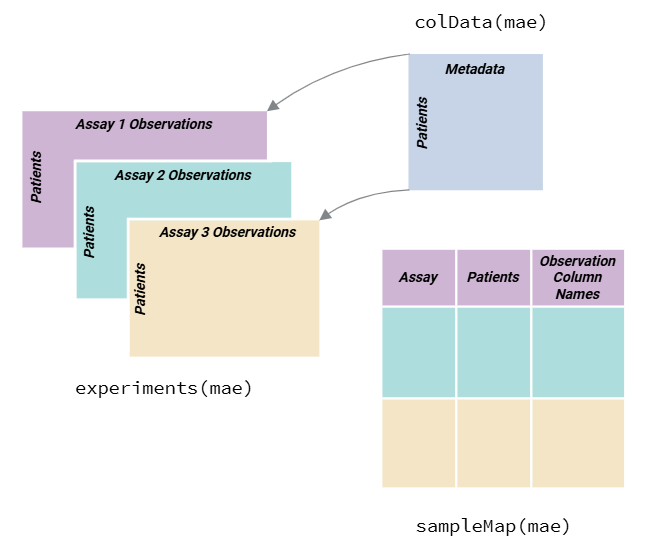

```{r setup,include=FALSE}
knitr::opts_chunk$set(echo = TRUE)
```


The `tidyexposomics` package is designed to facilitate the integration of exposure and omics data to identify exposure-omics associations and their relevance to health outcomes.`tidyexposomics` extends the tidy-Bioconductor ecosystem (e.g., tidybulk, tidySummarizedExperiment) to exposome multi-omics integration using the MultiAssayExperiment container. It provides tidyverse-style accessors and functions for association testing, multi-omics integration, and ontology-driven enrichment, in an effort to complement existing tidy-Bioc tools.


```{r pkg-overview, echo=FALSE,out.width="150%",fig.align='center',fig.cap="tidyexposomics pipeline overview. QC, association testing, integration, and enrichment steps on a MultiAssayExperiment."}
knitr::include_graphics("./overview.png")
```

# Installation

```{r install, eval=FALSE}
# install the package
BiocManager::install("tidyexposomics")

# load the package
library(tidyexposomics)
```

# Command Structure
<hr>

To make the package more user-friendly, we have named our functions to be more intuitive. For example, we use the following naming conventions:

```{r command-str, echo=FALSE,fig.align='center',fig.cap= "Command naming conventions used throughout `tidyexposomics`. More complex pipelines begin with the `run_` prefix, visualizations with `plot_`, and data processing with `filter_`, `transform_`, `pivot_`, or `extract_` prefixes.",out.width="80%"}

knitr::include_graphics("./command_str.png")
```

We provide functionality to either add results to the existing object storing the omics/exposure data or to return results directly using `action = "get"`. We suggest adding results, given that pipeline steps are tracked and can be output to the R console, plotted as a workflow diagram, or exported to an Excel worksheet.

# Loading Data
<hr>

To get started we need to load the data. The `create_exposomicset` function is used to create a `MultiAssayExperiment` object that contains exposure and omics data. As a quick introduction, a `MultiAssayExperiment` object is a container for storing multiple assays (e.g., omics data) and their associated metadata:


```{r mae-overview,echo=FALSE,fig.align='center',fig.cap="Overview of the MultiAssayExperiment structure linking samples, assays, and metadata."}

```

We use the MultiAssayExperiment object to store the exposure and omics data. The create_expomicset function has several arguments:

- `codebook`: is a data frame that contains information about the variables in the exposure metadata. The column names must contain variable where the values are the column names of the exposure data frame, and category which contains general categories for the variable names. This is the data frame you created with the [ontology annotation app](./exposure_annotation.Rmd)!

- `exposure`: is a data frame that contains the exposure and other metadata.

- `omics`: is a list of data frames that contain the omics data.

- `row_data`: argument is a list of data frames that contain information about the rows of each omics data frame.


We are going to start by loading in example data pulled from the [ISGlobal Exposome Data Challenge 2021](https://doi.org/10.1016/j.envint.2022.107422) (Maitre et al., 2022). Specifically, we will examine how exposures and omics features relate to asthma status in asthma patients with a lower socioeconomic status (SES).


```{r load-libraries,message=FALSE,warning=FALSE}
# Load Libraries
library(tidyverse)
library(tidyexposomics)
```


```{r load-data}
# Load example data
data("tidyexposomics_example")

# Create exposomic set object
expom <- create_exposomicset(
    codebook = tidyexposomics_example$annotated_cb,
    exposure = tidyexposomics_example$meta,
    omics = list(
        "Gene Expression" = tidyexposomics_example$exp_filt,
        "Methylation" = tidyexposomics_example$methyl_filt
    ),
    row_data = list(
        "Gene Expression" = tidyexposomics_example$exp_fdata,
        "Methylation" = tidyexposomics_example$methyl_fdata
    )
)
```

We are interested in how the exposome affects health outcomes, so let’s define which metadata variables represent exposure variables.

```{r exp-vars}
# Grab exposure variables
exp_vars <- tidyexposomics_example$annotated_cb |>
    filter(category %in% c(
        "aerosol",
        "main group molecular entity",
        "polyatomic entity"
    )) |>
    pull(variable) |>
    as.character()
```

# Quality Control
<hr>

## Missingness

Oftentimes when collecting data, there are missing values. Let’s use the `plot_missing` function to determine where our missing values are:

```{r missing-bar,fig.height=3,fig.width=6,fig.cap="Count of features with missing data above a 0% missingness threshold by data layer. Exposure data have variables with missingness."}

# Plot the missingness summary
plot_missing(
    exposomicset = expom,
    plot_type = "summary",
    threshold = 0
)
```

Here we see that there are 4 variables in the exposure data that are missing data. Let’s take a look at them:

```{r missing-bar-lollipop,fig.height=2,fig.width=4,fig.cap= "Percent missingness per exposure variable. Parity, `h_parity_None`, shows the highest missingness."}

# Plot missing variables withing exposure group
plot_missing(
    exposomicset = expom,
    plot_type = "lollipop",
    threshold = 0,
    layers = "Exposure"
)
```

Here we see that one variable, `h_parity_None`, has about 4% missing values. We can apply a missingness filter using the `filter_missing` function. However, given that this level of missingness is quite low, we will not be applying a missingness filter and instead impute the missing data.

## Imputation

The `run_impute_missing` function is used to impute missing values. Here we can specify the imputation method for exposure and omics data separately.

The `exposure_impute_method` argument is used to set the imputation method for exposure data, and the `omics_impute_method` argument is used to set the imputation method for omics data. The `omics_to_impute` argument is used to specify which omics data to impute. Here we will impute the exposure data given using the `missforest` method, but other options for imputation methods include:

- `median`: Imputes missing values with the median of the variable.

- `mean`: Imputes missing values with the mean of the variable.

- `knn`: Uses k-nearest neighbors to impute missing values.

- `mice`: Uses the Multivariate Imputation by Chained Equations (MICE) method to impute missing values.

- `missforest`: Uses the MissForest method to impute missing values.

- `lod_sqrt2`: Imputes missing values using the square root of the lower limit of detection (LOD) for each variable. This is useful for variables that have a lower limit of detection, such as chemical exposures.

```{r impute-missing}

# Impute missing values
expom <- run_impute_missing(
    exposomicset = expom,
    exposure_impute_method = "missforest",
    exposure_cols = exp_vars
)
```

## Filtering Omics Features

We can filter omics features based on variance or expression levels. The `filter_omics` function is used to filter omics features. The method argument is used to set the method for filtering. Here we can use either:

- **Variance**: Filters features based on variance. We recommend this for omics based on continuous measurements, such as log-transformed counts, M-values, protein intensities, or metabolite concentrations.

- **Expression**: Filters features based on expression levels. We recommend this for omics where many values may be near-zero or zero, such as RNA-seq data.


The `assays` argument is used to specify which omics data to filter. The `assay_name` argument is used to specify which assay to filter. The `min_var`, `min_value`, and `min_prop` arguments are used to set the minimum variance, minimum expression value, and minimum proportion of samples exceeding the minimum value, respectively.


```{r filter-omics}

# filter omics layers by variance and expression
# Methylation filtering
expom <- filter_omics(
    exposomicset = expom,
    method = "variance",
    assays = "Methylation",
    assay_name = 1,
    min_var = 0.05
)

# Gene expression filtering
expom <- filter_omics(
    exposomicset = expom,
    method = "expression",
    assays = "Gene Expression",
    assay_name = 1,
    min_value = 1,
    min_prop = 0.3
)
```

## Normality Check

When determining variable associations, it is important to check the normality of the data. The `run_normality_check` function is used to check the normality of the data.

```{r normality-check}

# Check variable normality
expom <- run_normality_check(
    exposomicset = expom,
    action = "add"
)
```

The `transform_exposure` function is used to transform the data to make it more normal. Here the transform_method is set to `boxcox_best` as it will automatically select the best transformation method based on the data. The `transform_method` can be manually set to `log2`, `sqrt`, or `x_1_3` as well. We specify the exposure_cols argument to set the columns to transform.

```{r trasform-vars}

# Transform variables
expom <- transform_exposure(
    exposomicset = expom,
    transform_method = "boxcox_best",
    exposure_cols = exp_vars
)
```

To check the normality of the exposure data, we can use the `plot_normality_summary` function. This function plots the normality of the data before and after transformation. The `transformed` argument is set to `TRUE` to plot the normality status of the transformed data.

```{r norm-plot,fig.width= 4,fig.height= 4, fig.cap= "Normality status of numeric exposure variables after Box-Cox transformation."}

# Examine normality summary
plot_normality_summary(
    exposomicset = expom,
    transformed = TRUE
)
```


## Principal Component Analysis

To identify the variability of the data, we can perform a principal component analysis (PCA). The `run_pca` performs a joint PCA across all numeric exposures and omic assays after standardization, identifying shared axes of variation across layers. The resulting PCs in `colData()` reflect integrated sample-level variance across all data types, and outliers are defined in that joint multi-omics PC space. 

Here we specify that we would like to log-transform the exposure and omics data before performing PCA using the `log_trans_exp` and the `log_trans_omics` arguments, respectively. We automatically identify sample outliers based on the Mahalanobis distance, a measure of the distance between a point and a distribution.


```{r pca}

# Perform principal component analysis
expom <- run_pca(
    exposomicset = expom,
    log_trans_exp = TRUE,
    log_trans_omics = TRUE,
    action = "add"
)
```


```{r pca-plot, fig.align='center', fig.width= 9, fig.height= 7,fig.cap= "PCA of sample and feature space with sample outlier detection."}

# Plot the PCA plot of sample and feature space
plot_pca(exposomicset = expom)
```

Here we see one sample outlier, and that most variation is captured in the first two principal components for both features and samples. We can filter out the outlier using the `filter_sample_outliers` function. 

```{r filt-outliers}

# Filter out sample outliers
expom <- filter_sample_outliers(
    exposomicset = expom,
    outliers = c("s1231")
)
```

To understand the relationship between the principal components and exposures we can correlate them using the `run_correlation` function. Here we specify that the `feature_type` is `pcs` for principal components, specify a set of exposure variables, `exp_vars`, and the number of principal components, `n_pcs.` We set `correlation_cutoff` to `0` and `pval_cutoff` to `1` to initially include all correlations.


```{r corr-pcs}

# Run the correlation analysis
expom <- run_correlation(
    exposomicset = expom,
    feature_type = "pcs",
    exposure_cols = exp_vars,
    n_pcs = 20,
    action = "add",
    correlation_cutoff = 0,
    pval_cutoff = 1
)
```


We can visualize these correlations with the `plot_correlation_tile` function. We specify we are plotting the `feature_type` of `pcs` to grab the principal component correlation results. We then set the significance threshold to 0.05 with the `pval_cutoff` argument.


```{r plot-pc-corr,fig.width= 7,fig.height= 2.2,fig.cap= "Correlation heatmap of exposures versus principal components. Child lead levels (`hs_pb_c_Log2`) and maternal BPA levels (`hs_bpa_madj_Log2`) are associated with the most principal components."}


# Plot the correlation tile plot
plot_correlation_tile(
    exposomicset = expom,
    feature_type = "pcs",
    pval_cutoff = 0.05
)
```


## Exposure Summary

We can summarize the exposure data using the `run_summarize_exposures` function. This function calculates summary statistics for each exposure variable, including the number of values, number of missing values, minimum, maximum, range, sum, median, mean, standard error, and confidence intervals. The `exposure_cols` argument determines which variables to include in the summary.


```{r exp-sum, fig.width=6, fig.height=4}

# Summarize exposure data
run_summarize_exposures(
    exposomicset = expom,
    action = "get",
    exposure_cols = exp_vars
) |>
    head()
```

## Exposure Visualization
<hr>

To visualize our exposure data, we can use the `plot_exposures` function. This function allows us to plot the exposure data in a variety of ways. Here we will plot the exposure data using a boxplot. The `exposure_cat` argument is used to set the exposure category to plot. Additionally, we could specify `exposure_cols` to only plot certain exposures. The `plot_type` argument is used to set the type of plot to create. Here we use a boxplot, but we could also use a ridge plot. 

```{r plot-aerosol, fig.width=4, fig.height=3.5, fig.cap="Distribution of aerosol exposures by sex."}

# Plot aerosol exposure distributions by sex
plot_exposures(
    exposomicset = expom,
    group_by = "e3_sex_None",
    exposure_cat = "aerosol",
    plot_type = "boxplot",
    ylab = "Values",
    title = "Aerosol Exposure by Sex"
)
```

Here we do not see any significant differences in aerosol exposure between males and females.

# Sample-Exposure Association
<hr>

## Sample Clustering

The `run_cluster_samples` function is used to cluster samples based on the exposure data, clustering approaches are available by setting the `clustering_approach` argument. Here we use the `dynamic` approach, which uses a dynamic tree cut method to identify clusters. Other options are:

- `gap`: **Gap statistic method (default)**; estimates optimal `k` by comparing within-cluster dispersion to that of reference data.

- `diana`: **Divisive hierarchical clustering (DIANA)**; chooses `k` based on the largest drop in dendrogram height.

- `elbow`: **Elbow method**; detects the point of maximum curvature in within-cluster sum of squares (WSS) to determine `k`.

- `dynamic`: **Dynamic tree cut**; adaptively detects clusters from a dendrogram structure without needing to predefine `k`.

- `density`: **Density-based clustering** (via `densityClust`); identifies clusters based on local density peaks in distance space.

```{r sample-clusters}

# Sample clustering
expom <- run_cluster_samples(
    exposomicset = expom,
    exposure_cols = exp_vars,
    clustering_approach = "dynamic",
    action = "add"
)
```

We plot the sample clusters using the `plot_sample_clusters` function. This function plots z-scored values of the exposure data for each sample, colored by the cluster assignment. The `exposure_cols` argument is used to set the columns to plot.


```{r plot-sample-clusters, fig.height=4, fig.width=12, fig.cap="Sample clustering heatmap using exposure profiles (z-scored). Clusters appear mostly driven by aerosol exposure during pregnancy."}

# Plot the sample clusters
plot_sample_clusters(
    exposomicset = expom,
    exposure_cols = exp_vars
)
```

Here we see two clusters, largely driven by particulate matter/aerosol exposure during pregnancy (`h_pm25_ratio_preg_None` and `h_pm10_ratio_preg_None`).

## Exposure Correlations

The `run_correlation` function identifies correlations between exposure variables. We set `feature_type` to `exposures` to focus on exposure variables and use a correlation cutoff of `0.3` to filter for meaningful associations. This cutoff can be adjusted based on your data and analysis needs.

```{r correlate-exposures}

# Run correlation analysis
expom <- run_correlation(
    exposomicset = expom,
    feature_type = "exposures",
    action = "add",
    exposure_cols = exp_vars,
    correlation_cutoff = 0.3
)
```


To visualize the exposure correlations, we can use the `plot_circos_correlation` function. Here we will plot the circos plot. This function creates a circular plot of the exposure correlations. The `correlation_cutoff` argument is used to set the minimum correlation score for the association. Here we use a cutoff of `0.3`.

```{r exposure-circos-corr, fig.height=10,fig.width=10,fig.align='center',fig.cap="Circos view of exposure-exposure correlations (threshold 0.3)."}

# Plot exposure correlation circos plot
plot_circos_correlation(
    exposomicset = expom,
    feature_type = "exposures",
    corr_threshold = 0.3,
    exposure_cols = exp_vars
)
```

## Exposure-wide association (ExWAS)

The `run_association` function performs an ExWAS analysis to identify associations between exposures and outcomes. We specify the data source, outcome variable, feature set, and covariates for the analysis. Since we have a binary outcome, we set the model family to binomial.


```{r assoc-exposures}

# Perform ExWAS
expom <- run_association(
    exposomicset = expom,
    source = "exposures",
    outcome = "hs_asthma",
    feature_set = exp_vars,
    action = "add",
    family = "binomial"
)
```

To visualize the results of the ExWAS analysis, we can use the `plot_association` function, which will plot results for the the specified features. The `terms` argument is used to set the features to plot. The `filter_thresh` argument is used to set the threshold for filtering the results. The `filter_col` argument is used to set the column to filter on. Here we use `p.value` to filter on the p-value of the association. We can also include the R^2 or adjusted R^2 (if covariates are included) using the `r2_col` argument.


```{r plot-exposure-assoc,fig.height=3, fig.width=5, fig.align='center',fig.cap="ExWAS associations of exposures with asthma status. No exposures are significantly associated (P < 0.05) with asthma status."}

# Plot the association forest plot
plot_association(
    exposomicset = expom,
    source = "exposures",
    terms = exp_vars,
    filter_thresh = 0.05,
    filter_col = "p.value",
    r2_col = "r2"
)
```

Here we see that no exposure variables are significantly associated with our asthma status. Although we do see that confidence interval for child Mono-iso-butyl phthalate (MiBP) levels (`hs_mibp_cadj_Log2`) does not cross 0, indicating a negative, albeit not significant (P < 0.05) association.

We can also associate our omics features with an outcome of interest using the `run_association` function. Here we specify an additional argument, `top_n`, which is used to set the top number of high variance omics features to include per omics layer.

```{r associate-top-omics,fig.height=3,fig.width=4.5,fig.align='center'}

# Perform ExWAS
expom <- run_association(
    exposomicset = expom,
    outcome = "hs_asthma",
    source = "omics",
    top_n = 500,
    action = "add",
    family = "binomial"
)
```


Now we can visualize these results with a manhattan plot.

```{r plot-manhattan,fig.height=7, fig.width=5, fig.align='center',fig.cap="Manhattan plot of omics-wide associations with asthma status."}

# Plot the manhattan plot
plot_manhattan(
    exposomicset = expom,
    min_per_cat = 0,
    feature_col = "feature_clean",
    vars_to_label = c(
        "TC19001180.hg.1",
        "TC01000565.hg.1",
        "cg01937701",
        "hs_mibp_cadj_Log2"
    ),
    panel_sizes = c(1, 3, 1, 3, 1, 1, 1),
    facet_angle = 0
)
```


# Differential Abundance
<hr>

## Differential Abundance

We provide functionality to test for differentially abundant features associated with an outcome across multiple omics layers. This is done using the `run_differential_abundance` function, which fits a model defined by the user (using the `formula` argument) and supports several methods. Here we apply the `limma_trend` method, a widely used approach for analyzing omics data. Users can also specify how features are scaled (e.g. none, quantile, TMM) before fitting. 

```{r diff-abundance,results='hide'}

# Run differential abundance analysis
expom <- run_differential_abundance(
    exposomicset = expom,
    formula = ~hs_asthma,
    method = "limma_trend",
    scaling_method = "none",
    action = "add"
)
```


We can summarize the results of the differential abundance analysis with a volcano plot, which highlights features with a high log fold change and that are statistically significant. The `plot_volcano` function generates this visualization, with options to set thresholds for p-values and log fold changes, and to label a subset of top-ranked features. In this example, we use the `feature_clean` column to display interpretable feature names.

**Note:** we set the `pval_col` to `P.Value` for the purposes of this example, but we recommend keeping the default of `adj.P.Val` to use the adjusted p-values.


```{r volcano-plot,fig.height=3.5, fig.width=6, fig.align='center',fig.cap="Volcano plot of differentially abundant features across omics layers."}

# Plot the volcano plot
plot_volcano(
    exposomicset = expom,
    top_n_label = 3,
    feature_col = "feature_clean",
    logFC_thresh = log2(1),
    pval_thresh = 0.05,
    pval_col = "P.Value",
    logFC_col = "logFC",
    nrow = 1
)
```


# Exposure-Omics Association
<hr>

## Exposure-Omics Association

Above we saw that there are not too many omics features associated with asthma. Which may be due to the subsampling in this example or because exposures are driving different biology. Let's examine what omics features exposures are associated with.

```{r exp-omics-assoc, fig.align='center'}
# Run association testing between every exposure and omics feature
expom <- run_exposure_omics_association(
    exposomicset = expom,
    exposures = exp_vars,
    action = "add"
)
```

Now let's see how many omics features each exposure is associated with using the `plot_exposure_omics_association` function where we can either plot by the individual exposure or exposure category:

```{r plot-exp-omics-assoc, fig.align='center',fig.width=7,fig.height=2.5,fig.cap="Barplot of the number of omics features associated with exposures."}

# Plot the number of exposure-omics associations
plot_exposure_omics_association(
  exposomicset = expom,
  plot_type = "category",
  pval_col = "p.value",
  pval_thresh = 0.05)
```


Here we can see that there are omics features associated with exposures, while there are fewer that are associated with asthma directly.


# Enrichment Analysis
<hr>

Enrichment analysis tests whether a set of molecular features (e.g. differentially abundant genes, metabolites, etc.) is over-represented in a predefined biological process. The benefit of grouping our exposures into categories is that we can now determine how broad categories of exposures are tied to biological processes. The `run_enrichment` function can perform enrichment analysis on the following feature types:

- `degs`: Differentially abundant features.

- `degs_robust`: Robust differentially abundant features from the sensitivity analysis.

- `omics`: User chosen features.

- `factor_features`: Multi-omics factor features either from `factor_type = “common_top_factor_features”` or `“top_factor_features”`.

- `degs_cor`: Differentially abundant features correlated with a set of exposures.

- `omics_cor`: User chosen features correlated with a set of exposures.

- `factor_features_cor`: Multi-omics factor features correlated with a set of exposures.

Here we will run enrichment analysis on omics features associated with exposures. Specifically, we will grab omics features assoicated with aerosols using the `extract_results` function. This function allows us to pull any of the results we have been generating so far. We will then filter these association results to significant associations (p-value < 0.05) and those with the `category` "aerosol".

```{r var-map}
# Extract omics features associated with aerosols
var_map <- extract_results(
  exposomicset = expom,
  result = "association"
) |> 
  pluck("exposure_omics",
        "results_df") |> 
  filter(p.value<0.05) |>
  filter(category == "aerosol") |> 
  dplyr::select(
    exp_name = exp_name,
    variable = feature
    
  )
```

Now we will perform enrichment analysis and specify `feature_col` to represent the column in our feature metadata with IDs that can be mapped (i.e. gene names). We will be performing Gene ontology enrichment powered by the [`fenr` package](https://www.bioconductor.org/packages/release/bioc/html/fenr.html) (Fenr, 2025). Note that we specify a `clustering_approach.` This will cluster our enrichment terms by the molecular feature overlap. 


```{r enrichment}
# Run enrichment analysis on factor features correlated with exposures
expom <- run_enrichment(
    exposomicset = expom,
    variable_map = var_map,
    feature_type = "omics",
    feature_col = "feature_clean",
    db = c("GO"),
    species = "goa_human",
    fenr_col = "gene_symbol",
    padj_method = "none",
    pval_thresh = 0.1,
    min_set = 1,
    max_set = 800,
    clustering_approach = "diana",
    action = "add"
)
```

## Enrichment Visualizations

To visualize our enrichment results we provide several options:

- dot`plot: A dot plot showing the top enriched terms. The size of the dots represents the number of features associated with the term, while the color represents the significance of the term.

- `cnet`: A network plot showing the relationship between features and enriched terms.

- `network`: A network plot showing the relationship between enriched terms.

- `heatmap`: A heatmap showing the relationship between features and enriched terms.

- `summary`: A summary figure of the enrichment results.

### Enrichment Summary

To summarize the enrichment results, we can use the `plot_enrichment` function with the `plot_type` argument set to `summary.` This will plot a summary of the enrichment results, showing:

- The number of exposure categories per enrichment term group.

- The number of features driving the enrichment term group.

- A p-value distribution of the enrichment term group.

- The number of terms in the enrichment term group.

- The total number of terms per experiment name.

- The overlap in enrichment terms between experiments (i.e. between gene expression and methylation).

```{r enrichment-summary,fig.width=14,fig.height=5, fig.cap="Summary of enriched GO terms grouped by overlap and exposure category."}

# Plot the summary diagram
plot_enrichment(
    exposomicset = expom,
    feature_type = "omics",
    plot_type = "summary"
)
```

Here we see that it is just the features associated with “polyatomic entity” exposures that seem to be enriched. Additionally, there appears to be no overlap in terms between methylation and gene expression results.

### DotPlot

By setting the `plot_type` to dotplot we can create a dotplot to show which omics are associated with which terms. By specifying the `top_n_genes` we can add the most frequent features in that particular enrichment term group.


```{r enrichment-dotplot,fig.height=11, fig.width=11, fig.cap="Dotplot of top enriched GO terms by omics layer and exposure category."}

# Plot a dotplot of terms
plot_enrichment(
    exposomicset = expom,
    feature_type = "omics",
    plot_type = "dotplot",
    top_n = 15,
    add_top_genes = TRUE,
    top_n_genes = 5
)
```

### Term Network Plot

We can set the `plot_type` to `network` to understand how our enrichment terms are individually connected.

```{r enrichment-term-network, fig.width=6, fig.height=5, fig.cap="Network of enriched GO terms connected by shared genes."}

# Plot the term network plot
# Setting a seed so that the plot layout is consistent
set.seed(42)
plot_enrichment(
    exposomicset = expom,
    feature_type = "omics",
    plot_type = "network",
    label_top_n = 3
)
```

At the individual term level, we see that they differ by omics layer, with the gene expression driving terms related to vesicle traficking and the methylation data driving terms related to G protein-coupled receptor signaling.

### Heatmap

Setting the `plot_type` to `heatmap` can help us understand which genes are driving the enrichment terms. We have the additional benefit of being able to color our tiles by the Log_2_Fold Change from our differential abundance testing. Here we will examine group 2, given it seems to be driven by the most terms and multiple omics layers.


```{r enrichment-heatmap, warning=FALSE,fig.height=3, fig.width=8, fig.cap="Heatmap of genes driving enriched GO terms (Group 2) with log2 fold-change overlay."}

# Plot a heatmap of genes and corresponding GO terms
plot_enrichment(
    exposomicset = expom,
    feature_type = "omics",
    go_groups = "Group 2",
    plot_type = "heatmap",
    heatmap_fill = TRUE,
    feature_col = "feature_clean"
)
```


### Cnet Plot

Another way to visualize this information is with the `cnet` plot, where the enrichment terms are connected to the genes driving them.


```{r enrichment-cnetplot, fig.width=6, fig.height=6, fig.cap="Cnet plot linking enriched terms to contributing genes (Group 1)."}

# Plot the gene-term network
# Setting a seed so that the plot layout is consistent
set.seed(42)
plot_enrichment(
    exposomicset = expom,
    feature_type = "omics",
    go_groups = "Group 2",
    plot_type = "cnet",
    feature_col = "feature_clean"
)
```


# Pipeline Summary

To summarize the steps we have taken in this analysis, we can use the `run_pipeline_summary` function. This function will provide a summary of the steps taken in the analysis. We can set `console_print` to `TRUE` to print the summary to the console. Setting `include_notes` to `TRUE` will include notes on the steps taken in the analysis.


```{r pipeline-summary}

# Run the pipeline summary
expom |>
    run_pipeline_summary(console_print = TRUE, include_notes = TRUE)
```


## Saving Results

We can export the results in our `MultiAssayExperiment` to an Excel spreadsheet using the `extract_results_excel` function. Here we add all of our results to the Excel file, but we can choose certain results by changing the `result_types` argument.

```{r save-results}

# Save results
extract_results_excel(
    exposomicset = expom,
    file = tempfile(),
    result_types = "all"
)
```


## Session Info

```{r session_info}

sessionInfo()
```

## References


fenr. (n.d.). Bioconductor. Retrieved August 18, 2025, from https://www.bioconductor.org/packages/release/bioc/html/fenr.html  

Maitre, L., Guimbaud, J.-B., Warembourg, C., Güil-Oumrait, N., Petrone, P. M., Chadeau-Hyam, M., Vrijheid, M., Basagaña, X., Gonzalez, J. R., & Exposome Data Challenge Participant Consortium. (2022). State-of-the-art methods for exposure-health studies: Results from the exposome data challenge event. *Environment International, 168*(107422), 107422. https://doi.org/10.1016/j.envint.2022.107422  

mixOmics. (n.d.). Bioconductor. Retrieved August 18, 2025, from https://www.bioconductor.org/packages/devel/bioc/html/mixOmics.html  

MOFA2. (n.d.). Bioconductor. Retrieved August 18, 2025, from https://www.bioconductor.org/packages/release/bioc/html/MOFA2.html  

MultiAssay Special Interest Group. (2025, April 15). *MultiAssayExperiment: The Integrative Bioconductor Container.* https://www.bioconductor.org/packages/release/bioc/vignettes/MultiAssayExperiment/inst/doc/MultiAssayExperiment.html  

nipalsMCIA. (n.d.). Bioconductor. Retrieved August 18, 2025, from https://www.bioconductor.org/packages/release/bioc/html/nipalsMCIA.html  

Regularized and Sparse Generalized Canonical Correlation Analysis for Multiblock Data. (n.d.). Retrieved August 18, 2025, from https://rgcca-factory.github.io/RGCCA/  
